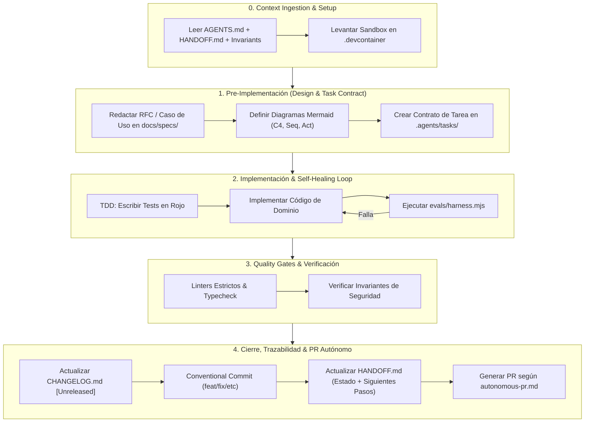

# 📘 AI-SDLC: Framework de Gobernanza, Arquitectura y Continuidad para Proyectos Agénticos

Este documento define el estándar oficial de ciclo de vida de desarrollo de software asistido por Inteligencia Artificial (**AI-Augmented Software Development Life Cycle**) y arquitectura **Agentic-Native** (inspirada en los sistemas autónomos tipo *Stripe Minions* y *SWE-bench*).

Su propósito es garantizar rigor técnico, diseño previo a la codificación, cero alucinaciones, sandboxing hermético y persistencia total de contexto entre sesiones.

---

## 1. Principios Fundamentales

1. **Spec-Driven Development (SDD) & Design-First:**
   - Ningún código se escribe sin una especificación validada en `docs/specs/` o contrato en `.agents/tasks/`.
   - Cada flujo de datos debe estar diagramado con **Mermaid** y validado con criterios de aceptación en formato **BDD / Gherkin**.

2. **Context Anchoring (Anti-Amnesia):**
   - El repositorio mantiene un archivo vivo de estado (`HANDOFF.md`) y directrices maestras (`AGENTS.md`).
   - Cualquier sesión futura (humana o con IA) retoma el trabajo exactamente donde se dejó en menos de 30 segundos.

3. **Hermetic Sandboxing & Self-Healing Loop:**
   - La ejecución y pruebas corren en contenedores reproducibles (`.devcontainer/`).
   - El harness de evaluación (`evals/harness.mjs`) proporciona retroalimentación determinista en bucle cerrado hasta lograr 100% de aserciones exitosas.

4. **Invariantes Arquitectónicos Inviolables:**
   - Reglas duras de ingeniería (`.agents/rules/invariants.md`) que prohíben accesos no autorizados a bases de datos, secretos hardcodeados o código sin tests.

5. **Trazabilidad Semántica Rigurosa:**
   - Mapeo 1:1 entre **Conventional Commits**, la sección `[Unreleased]` de `CHANGELOG.md` y las versiones bajo **SemVer** (`MAJOR.MINOR.PATCH`).

6. **"Zero Half-Done Implementations" (Ejecución Completa desde el Turno 1):**
   - Toda inicialización de proyecto, módulo o demo DEBE entregarse con su suite de tests ejecutables (`npm test`), configuración de tipos (`tsconfig.json`), pre-commit hooks (`lefthook.yml`), Eval Harness funcional (`evals/harness.mjs`) y script de demostración interactiva (`npm run demo:live`).
   - Queda estrictamente prohibido dejar código estático no ejecutable, aserciones vacías o componentes "a medias".

7. **Observabilidad Agéntica y Telemetría en Tiempo Real (Mission Control):**
   - El desarrollo autónomo de subagentes NO puede ser una caja negra.
   - Cada hito del ciclo de vida (ingestión, diseño, despacho de tareas, montaje de worktrees, ejecución de tests y merges) debe emitir eventos estructurados a `.agents/telemetry/events.jsonl` mediante `scripts/telemetry-logger.mjs`.
   - Todo proyecto incluye un panel visual HTML/JS (`npm run dashboard`) en `http://localhost:3333` para auditar estados, latencias y consumo de tokens en tiempo real.

---

## 2. Arquitectura del Repositorio Agentic-Native

```text
├── .agents/                        # 🤖 Módulos de Inteligencia Agéntica
│   ├── rules/
│   │   ├── invariants.md           # 🛡️ Límites arquitectónicos inviolables
│   │   └── style-guide.md          # Estándares de tipado y clean code
│   ├── tasks/
│   │   └── TASK_TEMPLATE.md        # 📋 Contratos de tareas con Eval Command
│   ├── mcp/
│   │   └── mcp-servers.json        # 🔌 Herramientas locales expuestas vía MCP
│   └── workflows/
│       └── autonomous-pr.md        # Protocolo de empaquetado de PRs autónomos
├── .devcontainer/                  # 🐳 Sandbox Hermético Reproducible
│   └── devcontainer.json           # Configuración de runtime y extensiones
├── docs/                           # 📚 Fuente de Verdad Documental
│   ├── INDEX.md                    # Matriz maestra de trazabilidad y catálogo
│   ├── architecture/               # Modelo C4 (Context, Container, Component)
│   ├── use-cases/                  # Casos de uso formales (UC-001, UC-002...)
│   ├── diagrams/                   # Catálogo de diagramas Mermaid
│   │   ├── sequences/              # SEQ-001... (Interacciones temporales)
│   │   ├── activities/             # ACT-001... (Flujos lógicos y decisiones)
│   │   ├── state-machines/         # STM-001... (Ciclos de vida de entidades)
│   │   └── entity-relationship/    # ERD-001... (Modelos de datos SQL/NoSQL)
│   ├── adr/                        # Architecture Decision Records (ADR-0001...)
│   └── specs/                      # Especificaciones funcionales y RFCs
├── evals/                          # 🧪 Harness de Evaluación Automatizada
│   ├── harness.mjs                 # Script ejecutor de pruebas de tareas
│   └── tasks/                      # Fixtures y benchmarks de evaluación
├── src/                            # Código fuente modular
├── tests/                          # E2E, integración y unit tests
├── AGENTS.md                       # Entrypoint para asistentes y agentes IA
├── CHANGELOG.md                    # Historial según Keep a Changelog
├── CONTRIBUTING.md                 # Guía de contribución, SemVer y branching
├── HANDOFF.md                      # Snapshot vivo de estado para tu "yo futuro"
└── README.md                       # Resumen ejecutivo, stack y quickstart
```

---

## 3. Ciclo de Vida del Desarrollo (Las 5 Fases)



---

## 4. Estándares y Convenciones de Ingeniería

### 4.1. Semantic Versioning (SemVer 2.0.0)
El formato de versión es `MAJOR.MINOR.PATCH`:
- **MAJOR (X.0.0):** Cambios incompatibles con la API anterior (Breaking changes).
- **MINOR (0.X.0):** Nuevas funcionalidades retrocompatibles.
- **PATCH (0.0.X):** Corrección de errores y bugs retrocompatibles.

### 4.2. Conventional Commits
Estructura obligatoria: `<tipo>(<ámbito opcional>): <descripción>`

- `feat(auth): add biometric passkey authentication` *(Bump MINOR)*
- `fix(billing): correct round-off calculation in tax invoice` *(Bump PATCH)*
- `refactor(core): decouple event dispatcher from logger` *(Bump PATCH)*
- `perf(db): add partial index for active user sessions` *(Bump PATCH)*
- `docs(specs): add sequence diagram for refund workflow`
- `test(e2e): add concurrency harness for cart checkout`
- `chore(deps): update dependency vitest to v2.0.0`
- `feat(api)!: migrate v1 payload to schema v2` *(Breaking Change -> Bump MAJOR)*

### 4.3. Keep a Changelog
El archivo `CHANGELOG.md` debe mantener siempre activa la sección `[Unreleased]` con las siguientes subcategorías estándar:
- `### Added` (Nuevas características)
- `### Changed` (Cambios en comportamiento existente)
- `### Deprecated` (Funcionalidades marcadas para eliminación futura)
- `### Removed` (Funcionalidades eliminadas)
- `### Fixed` (Corrección de bugs)
- `### Security` (Vulnerabilidades remediadas)

---

## 5. Tooling & Automatización Recomendada

| Categoría | Herramientas Recomendadas | Propósito |
| :--- | :--- | :--- |
| **Sandboxing** | Dev Containers / Docker | Aislamiento total de dependencias y ejecución limpia. |
| **Eval Harness** | `evals/harness.mjs` | Bucle cerrado de feedback y auto-corrección para el agente. |
| **Model Context Protocol** | `@modelcontextprotocol/sdk` | Herramientas estructuradas de introspección para la IA. |
| **Git Hooks** | `lefthook` o `husky` + `lint-staged` | Garantiza que nadie haga commit sin pasar linter y types. |
| **Commit Linter** | `@commitlint/cli` | Bloquea commits que no respeten Conventional Commits. |
| **Release Automático** | `release-it` o `semantic-release` | Automatiza el versionado `git tag` y parsea el changelog. |
| **Validación de Tipos & Lint** | `biome` o `eslint` + `typescript` | Feedback estricto en milisegundos para agentes IA. |
| **Testing & Cobertura** | `vitest` / `pytest` / `go test` | Pruebas unitarias, parametrizadas y de integración. |
