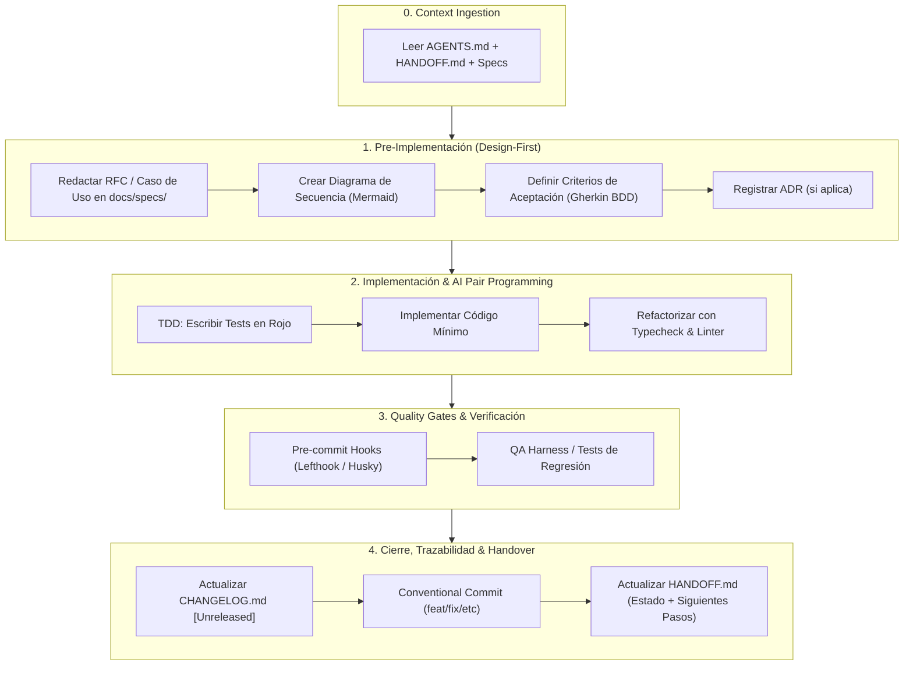

# 📘 AI-SDLC: Framework de Gobernanza, Arquitectura y Continuidad para Proyectos Agénticos

Este documento define el estándar oficial de ciclo de vida de desarrollo de software asistido por Inteligencia Artificial (**AI-Augmented Software Development Life Cycle**). Su propósito es garantizar rigor técnico, diseño previo a la codificación, cero alucinaciones y persistencia total de contexto entre sesiones de trabajo.

---

## 1. Principios Fundamentales

1. **Spec-Driven Development (SDD) & Design-First:**
   - Ningún código se escribe sin una especificación validada en `docs/specs/`.
   - Cada flujo de datos debe estar diagramado con **Mermaid** y validado con criterios de aceptación en formato **BDD / Gherkin**.

2. **Context Anchoring (Anti-Amnesia):**
   - El repositorio mantiene un archivo vivo de estado (`HANDOFF.md`) y directrices de agente (`AGENTS.md`).
   - Cualquier sesión futura (humana o con IA) retoma el trabajo exactamente donde se dejó en menos de 30 segundos.

3. **Quality Gates Deterministas:**
   - La IA nunca decide si el código está listo; lo deciden los linters, el tipado estricto, los tests unitarios/integración y los hooks de pre-commit.

4. **Trazabilidad Semántica Rigurosa:**
   - Mapeo 1:1 entre **Conventional Commits**, la sección `[Unreleased]` de `CHANGELOG.md` y las versiones bajo **SemVer** (`MAJOR.MINOR.PATCH`).

---

## 2. Arquitectura de Carpetas del Repositorio Estándar

```text
├── .agents/                        # Directrices y habilidades para agentes IA
│   ├── rules/                      # Reglas de estilo, seguridad y arquitectura
│   └── skills/                     # Scripts de utilidad y toolings específicos
├── .github/                        # Automatización CI/CD
│   └── workflows/
│       ├── ci.yml                  # Lint, Typecheck, Test, Mutation Testing
│       └── release.yml             # Release semántico automatizado
├── docs/                           # Fuente de verdad documental
│   ├── INDEX.md                    # Matriz maestra de trazabilidad y catálogo
│   ├── architecture/               # Modelo C4 (Context, Container, Component)
│   ├── use-cases/                  # Casos de uso formales (UC-001, UC-002...)
│   ├── diagrams/                   # Catálogo de diagramas Mermaid
│   │   ├── sequences/              # SEQ-001... (Interacciones temporales)
│   │   ├── activities/             # ACT-001... (Flujos lógicos y decisiones)
│   │   ├── state-machines/         # STM-001... (Ciclos de vida de entidades)
│   │   └── entity-relationship/    # ERD-001... (Modelos de datos SQL/NoSQL)
│   ├── adr/                        # Architecture Decision Records (ADR-0001...)
│   └── specs/                      # Especificaciones funcionales y RFCs
├── src/                            # Código fuente modular
├── tests/                          # E2E, integración y unit tests
├── AGENTS.md                       # Reglas maestras y directrices para agentes IA
├── CHANGELOG.md                    # Historial según Keep a Changelog
├── CONTRIBUTING.md                 # Guía de contribución, SemVer y branching
├── HANDOFF.md                      # Snapshot vivo de estado para tu "yo futuro"
└── README.md                       # Resumen ejecutivo, stack y quickstart
```

---

## 3. Ciclo de Vida del Desarrollo (Las 5 Fases)



---

## 4. Estándares y Convenciones de Ingeniería

### 4.1. Semantic Versioning (SemVer 2.0.0)
El formato de versión es `MAJOR.MINOR.PATCH`:
- **MAJOR (X.0.0):** Cambios incompatibles con la API anterior (Breaking changes).
- **MINOR (0.X.0):** Nuevas funcionalidades retrocompatibles.
- **PATCH (0.0.X):** Corrección de errores y bugs retrocompatibles.

### 4.2. Conventional Commits
Estructura obligatoria: `<tipo>(<ámbito opcional>): <descripción>`

- `feat(auth): add biometric passkey authentication` *(Bump MINOR)*
- `fix(billing): correct round-off calculation in tax invoice` *(Bump PATCH)*
- `refactor(core): decouple event dispatcher from logger` *(Bump PATCH)*
- `perf(db): add partial index for active user sessions` *(Bump PATCH)*
- `docs(specs): add sequence diagram for refund workflow`
- `test(e2e): add concurrency harness for cart checkout`
- `chore(deps): update dependency vitest to v2.0.0`
- `feat(api)!: migrate v1 payload to schema v2` *(Breaking Change -> Bump MAJOR)*

### 4.3. Keep a Changelog
El archivo `CHANGELOG.md` debe mantener siempre activa la sección `[Unreleased]` con las siguientes subcategorías estándar:
- `### Added` (Nuevas características)
- `### Changed` (Cambios en comportamiento existente)
- `### Deprecated` (Funcionalidades marcadas para eliminación futura)
- `### Removed` (Funcionalidades eliminadas)
- `### Fixed` (Corrección de bugs)
- `### Security` (Vulnerabilidades remediadas)

---

## 5. Tooling & Automatización Recomendada

| Categoría | Herramientas Recomendadas | Propósito |
| :--- | :--- | :--- |
| **Git Hooks** | `lefthook` o `husky` + `lint-staged` | Garantiza que nadie haga commit sin pasar linter y types. |
| **Commit Linter** | `@commitlint/cli` + `@commitlint/config-conventional` | Bloquea commits que no respeten el estándar. |
| **Release Automático** | `release-it` o `semantic-release` | Automatiza el versionado `git tag` y parsea el changelog. |
| **Validación de Tipos & Lint** | `biome` o `eslint` + `typescript` | Feedback estricto en milisegundos para agentes IA. |
| **Testing & Cobertura** | `vitest` / `pytest` / `go test` + `c8` | Pruebas unitarias, parametrizadas y de integración. |
| **Diagramas como Código** | `mermaid-cli` (`mmdc`) | Verificación estática de diagramas en CI. |

---

## 6. Checklist de Inicialización para Nuevos Proyectos

1. [ ] Inicializar Git y configurar `.gitignore`.
2. [ ] Copiar las plantillas base: `AGENTS.md`, `HANDOFF.md`, `CHANGELOG.md`, `CONTRIBUTING.md`.
3. [ ] Crear la estructura de carpetas `docs/` (`specs/`, `adr/`, `diagrams/`, `qa/`).
4. [ ] Configurar Linters y Git Hooks (`npx lefthook install`).
5. [ ] Redactar la primera especificación funcional `docs/specs/RFC-001-setup.md`.
6. [ ] Hacer el commit inicial: `chore: initial repository scaffolding with AI-SDLC framework`.
