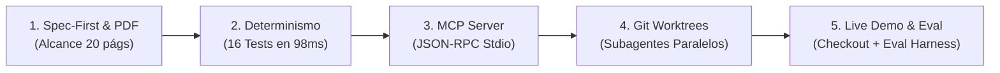

# 🎤 Guía Maestra de Presentación en Vivo: Demo ShopFast E-commerce

Esta guía proporciona el **guión paso a paso**, los **comandos exactos de terminal** y los **puntos clave de oratoria** para presentar ante CTOs, Tech Leads, Arquitectos y Equipos de Ingeniería.

---

## ⏱️ Estructura de la Presentación (15 Minutos)



---

## 🎬 Acto 1: La Ingestión del Alcance (2 Minutos)
* **Qué mostrar en pantalla:** [`Caso-Práctico-Documento-de-Alcance.pdf`](./Caso-Práctico-Documento-de-Alcance.pdf) y [`docs/INDEX.md`](./docs/INDEX.md).
* **Qué decir (Talking Points):**
  > *"Partimos de un documento de requerimientos real de 20 páginas de un cliente retail (ShopFast S.A.): 2,500 productos, checkout en 3 pasos, Stripe, CourierFast y alta concurrencia. En lugar de hacer 'Vibe Coding' y pedirle a la IA que 'haga una tienda', aplicamos el framework AI-SDLC: todo se modela primero en C4, casos de uso formales con BDD Gherkin y diagramas de secuencia Mermaid antes de tocar una sola línea de código."*

---

## 🎬 Acto 2: Verificación Determinista con Tests Reales (3 Minutos)
* **Comando a ejecutar:**
  ```bash
  npm test
  ```
* **Qué decir (Talking Points):**
  > *"Observen esto: aquí no hay un LLM opinando si el código funciona. Son 16 aserciones matemáticas reales ejecutadas en Node.js en menos de 100 milisegundos a través de 8 suites, validando cada regla de negocio del documento de alcance."*

---

## 🎬 Acto 3: Herramientas Agénticas con Servidor MCP en Vivo (3 Minutos)
* **Comando a ejecutar:**
  ```bash
  npm run mcp:test
  ```
* **Salida esperada:**
  ```text
  🔌 [Test MCP] Iniciando servidor MCP y enviando peticiones JSON-RPC...
  ✅ [1/3] tools/list respondido correctamente con 3 herramientas
  ✅ [2/3] query_product_stock retornó: Laptop Gaming Pro 16" | Stock: 15 uds
  ✅ [3/3] simulate_stripe_webhook retornó: payment_intent.succeeded | Firma Verificada: true
  🎉 [MCP Server] 100% OPERATIVO Y VALIDADO VÍA STDIO JSON-RPC 2.0
  ```
* **Qué decir (Talking Points):**
  > *"Los agentes de IA no deben ejecutar comandos bash arbitrarios que puedan destruir el sistema. En el AI-SDLC interactúan mediante un Servidor MCP (Model Context Protocol) por stdio JSON-RPC que expone herramientas fuertemente tipadas y seguras."*

---

## 🎬 Acto 4: Paralelización Real de Subagentes con Git Worktrees (4 Minutos)
* **Comando a ejecutar:**
  ```bash
  npm run worktrees:run
  ```
* **Qué muestra en pantalla:**
  - Montaje de 3 Git Worktrees físicos en directorios aislados (`.worktrees/subagent-1`, `subagent-2`, `subagent-3`).
  - Ejecución simultánea de contratos de tareas (`TASK-001`, `TASK-002`, `TASK-003`).
  - Verificación del Eval Harness en cada subagente.
  - Fusión sin conflictos y desmontaje limpio de los worktrees.
* **Qué decir (Talking Points):**
  > *"Esta es la respuesta a la pregunta del millón: '¿Cómo hago para que 5 agentes programen a la vez sin pisarse?'. Usamos Git Worktrees y Vertical Slices: cada subagente trabaja en su propia carpeta física y rama Git, corre su suite de pruebas y se fusiona limpiamente sin ningún conflicto de fusión."*

---

## 🎬 Acto 5: Simulación de Compra en Vivo y Eval Harness (3 Minutos)
* **Comandos a ejecutar:**
  ```bash
  npm run demo:live
  npm run eval:task
  ```
* **Qué decir (Talking Points):**
  > *"Cerramos la demostración con la simulación interactiva de compra de punta a punta y el Eval Harness global. Este es el estándar enterprise que transforma la IA en un equipo de ingeniería predecible, seguro y auditable."*
