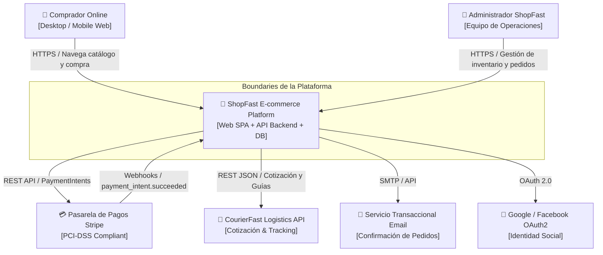

# 🏛️ C4 Nivel 1: Diagrama de Contexto del Sistema — ShopFast

```mermaid
flowchart TD
    Customer["👤 Comprador Online\n[Desktop / Mobile Web]"]
    Admin["👤 Administrador ShopFast\n[Equipo de Operaciones]"]

    subgraph ShopFastBoundary[" Boundaries de la Plataforma "]
        ShopFastSystem["🏢 ShopFast E-commerce Platform\n[Web SPA + API Backend + DB]"]
    end

    Stripe["💳 Pasarela de Pagos Stripe\n[PCI-DSS Compliant]"]
    Courier["🚚 CourierFast Logistics API\n[Cotización & Tracking]"]
    EmailSvc["📧 Servicio Transaccional Email\n[Confirmación de Pedidos]"]
    GoogleAuth["🔐 Google / Facebook OAuth2\n[Identidad Social]"]

    Customer -->|HTTPS / Navega catálogo y compra| ShopFastSystem
    Admin -->|HTTPS / Gestión de inventario y pedidos| ShopFastSystem

    ShopFastSystem -->|REST API / PaymentIntents| Stripe
    Stripe -->|Webhooks / payment_intent.succeeded| ShopFastSystem

    ShopFastSystem -->|REST JSON / Cotización y Guías| Courier
    ShopFastSystem -->|SMTP / API| EmailSvc
    ShopFastSystem -->|OAuth 2.0| GoogleAuth
```
