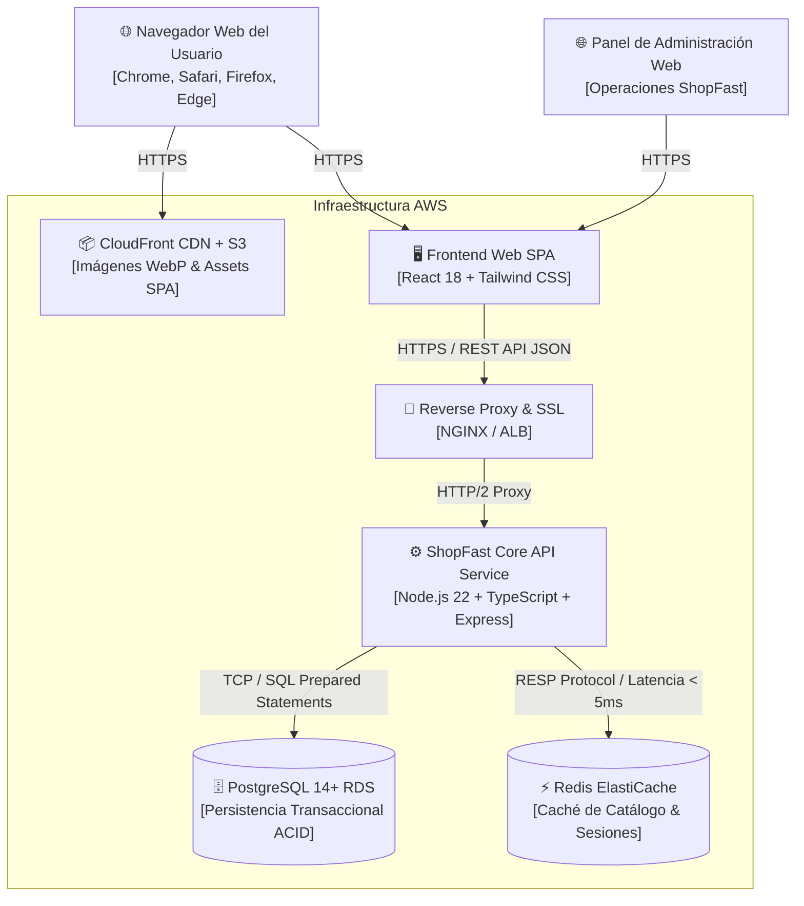

# 🏛️ C4 Nivel 2: Diagrama de Contenedores — ShopFast

```mermaid
flowchart TB
    UserBrowser["🌐 Navegador Web del Usuario\n[Chrome, Safari, Firefox, Edge]"]
    AdminBrowser["🌐 Panel de Administración Web\n[Operaciones ShopFast]"]

    subgraph AWSCloud[" Infraestructura AWS "]
        CDN["📦 CloudFront CDN + S3\n[Imágenes WebP & Assets SPA]"]
        WebSPA["🖥️ Frontend Web SPA\n[React 18 + Tailwind CSS]"]
        
        Gateway["🚪 Reverse Proxy & SSL\n[NGINX / ALB]"]
        APIServer["⚙️ ShopFast Core API Service\n[Node.js 22 + TypeScript + Express]"]
        
        DB[("🗄️ PostgreSQL 14+ RDS\n[Persistencia Transaccional ACID]")]
        RedisCache[("⚡ Redis ElastiCache\n[Caché de Catálogo & Sesiones]")]
    end

    UserBrowser -->|HTTPS| CDN
    UserBrowser -->|HTTPS| WebSPA
    AdminBrowser -->|HTTPS| WebSPA

    WebSPA -->|HTTPS / REST API JSON| Gateway
    Gateway -->|HTTP/2 Proxy| APIServer

    APIServer -->|TCP / SQL Prepared Statements| DB
    APIServer -->|RESP Protocol / Latencia < 5ms| RedisCache
```
