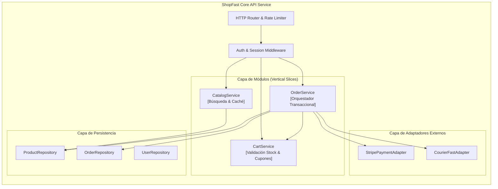

# 🏛️ C4 Nivel 3: Diagrama de Componentes — Core API Service

```mermaid
flowchart LR
    subgraph APIServer[" ShopFast Core API Service "]
        direction TB
        Router["HTTP Router & Rate Limiter"]
        AuthMid["Auth & Session Middleware"]

        subgraph Modules[" Capa de Módulos (Vertical Slices) "]
            CatalogSvc["CatalogService\n[Búsqueda & Caché]"]
            CartSvc["CartService\n[Validación Stock & Cupones]"]
            OrderSvc["OrderService\n[Orquestador Transaccional]"]
        end

        subgraph Adapters[" Capa de Adaptadores Externos "]
            StripeAdapter["StripePaymentAdapter"]
            CourierAdapter["CourierFastAdapter"]
        end

        subgraph Repositories[" Capa de Persistencia "]
            ProductRepo["ProductRepository"]
            OrderRepo["OrderRepository"]
            UserRepo["UserRepository"]
        end
    end

    Router --> AuthMid
    AuthMid --> CatalogSvc
    AuthMid --> CartSvc
    AuthMid --> OrderSvc

    CatalogSvc --> ProductRepo
    OrderSvc --> CartSvc
    OrderSvc --> StripeAdapter
    OrderSvc --> CourierAdapter
    OrderSvc --> OrderRepo
    OrderSvc --> ProductRepo
```
