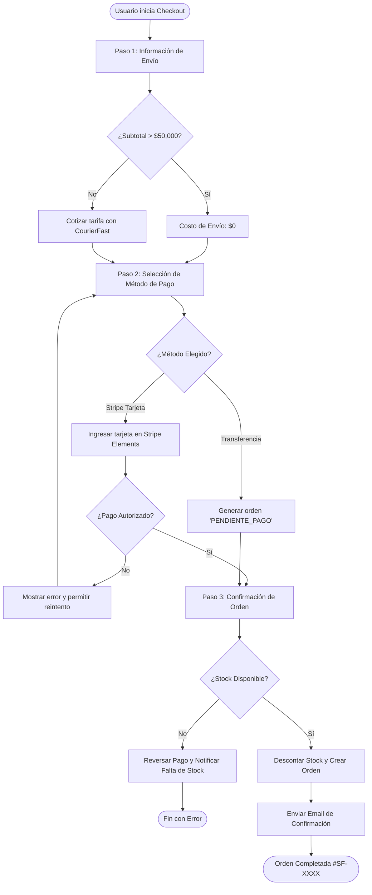

# 🔄 [ACT-001] Diagrama de Actividad: Flujo Lógico de Compra

```mermaid
flowchart TD
    Start([Usuario inicia Checkout]) --> Step1[Paso 1: Información de Envío]
    Step1 --> CheckFreeShipping{¿Subtotal > $50,000?}
    CheckFreeShipping -- Sí --> FreeShip[Costo de Envío: $0]
    CheckFreeShipping -- No --> QuoteShip[Cotizar tarifa con CourierFast]
    
    FreeShip --> Step2[Paso 2: Selección de Método de Pago]
    QuoteShip --> Step2

    Step2 --> PayMethod{¿Método Elegido?}
    
    PayMethod -- Stripe Tarjeta --> StripeFlow[Ingresar tarjeta en Stripe Elements]
    PayMethod -- Transferencia --> BankFlow[Generar orden 'PENDIENTE_PAGO']

    StripeFlow --> ProcessPay{¿Pago Autorizado?}
    ProcessPay -- No --> ErrPay[Mostrar error y permitir reintento]
    ErrPay --> Step2

    ProcessPay -- Sí --> Step3[Paso 3: Confirmación de Orden]
    BankFlow --> Step3

    Step3 --> StockTx{¿Stock Disponible?}
    StockTx -- No --> Rollback[Reversar Pago y Notificar Falta de Stock]
    Rollback --> EndFail([Fin con Error])

    StockTx -- Sí --> CommitOrder[Descontar Stock y Crear Orden]
    CommitOrder --> SendEmail[Enviar Email de Confirmación]
    SendEmail --> EndSuccess([Orden Completada #SF-XXXX])
```
