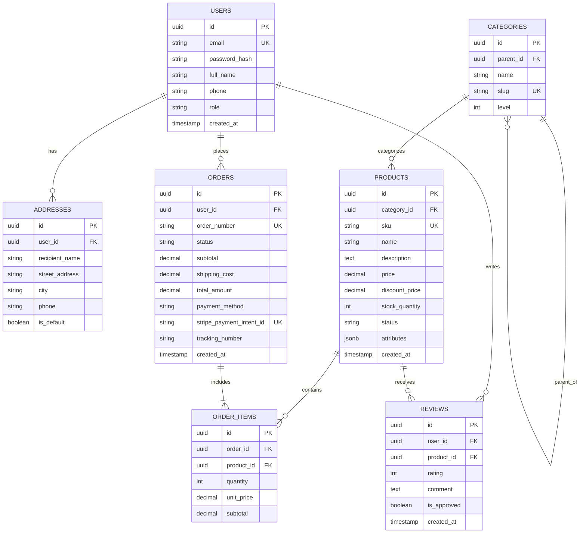

# 🗄️ [ERD-001] Diagrama Entidad-Relación: Base de Datos ShopFast (PostgreSQL)

```mermaid
erDiagram
    USERS ||--o{ ADDRESSES : has
    USERS ||--o{ ORDERS : places
    USERS ||--o{ REVIEWS : writes
    
    USERS {
        uuid id PK
        string email UK
        string password_hash
        string full_name
        string phone
        string role
        timestamp created_at
    }

    ADDRESSES {
        uuid id PK
        uuid user_id FK
        string recipient_name
        string street_address
        string city
        string phone
        boolean is_default
    }

    CATEGORIES ||--o{ CATEGORIES : parent_of
    CATEGORIES ||--o{ PRODUCTS : categorizes
    CATEGORIES {
        uuid id PK
        uuid parent_id FK
        string name
        string slug UK
        int level
    }

    PRODUCTS ||--o{ ORDER_ITEMS : contains
    PRODUCTS ||--o{ REVIEWS : receives
    PRODUCTS {
        uuid id PK
        uuid category_id FK
        string sku UK
        string name
        text description
        decimal price
        decimal discount_price
        int stock_quantity
        string status
        jsonb attributes
        timestamp created_at
    }

    ORDERS ||--|{ ORDER_ITEMS : includes
    ORDERS {
        uuid id PK
        uuid user_id FK
        string order_number UK
        string status
        decimal subtotal
        decimal shipping_cost
        decimal total_amount
        string payment_method
        string stripe_payment_intent_id UK
        string tracking_number
        timestamp created_at
    }

    ORDER_ITEMS {
        uuid id PK
        uuid order_id FK
        uuid product_id FK
        int quantity
        decimal unit_price
        decimal subtotal
    }

    REVIEWS {
        uuid id PK
        uuid user_id FK
        uuid product_id FK
        int rating
        text comment
        boolean is_approved
        timestamp created_at
    }
```
