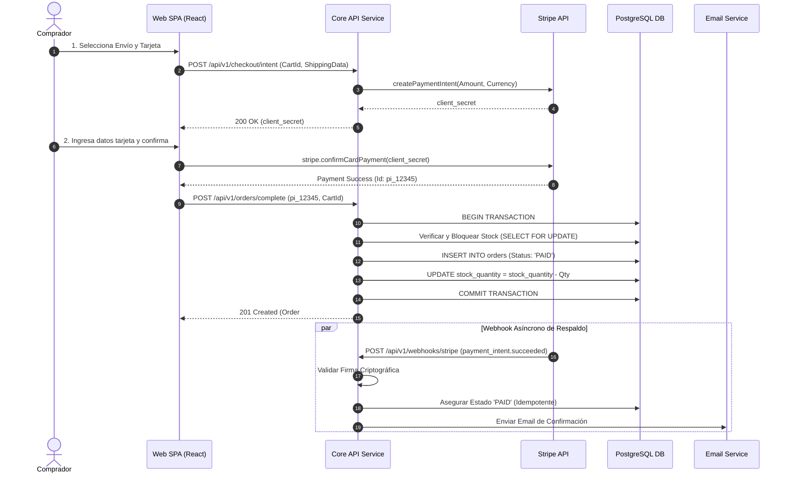

# 📊 [SEQ-001] Diagrama de Secuencia: Checkout y Webhook de Stripe

```mermaid
sequenceDiagram
    autonumber
    actor User as Comprador
    participant Web as Web SPA (React)
    participant API as Core API Service
    participant Stripe as Stripe API
    participant DB as PostgreSQL DB
    participant Email as Email Service

    User->>Web: 1. Selecciona Envío y Tarjeta
    Web->>API: POST /api/v1/checkout/intent (CartId, ShippingData)
    API->>Stripe: createPaymentIntent(Amount, Currency)
    Stripe-->>API: client_secret
    API-->>Web: 200 OK (client_secret)

    User->>Web: 2. Ingresa datos tarjeta y confirma
    Web->>Stripe: stripe.confirmCardPayment(client_secret)
    Stripe-->>Web: Payment Success (Id: pi_12345)

    Web->>API: POST /api/v1/orders/complete (pi_12345, CartId)
    API->>DB: BEGIN TRANSACTION
    API->>DB: Verificar y Bloquear Stock (SELECT FOR UPDATE)
    API->>DB: INSERT INTO orders (Status: 'PAID')
    API->>DB: UPDATE stock_quantity = stock_quantity - Qty
    API->>DB: COMMIT TRANSACTION
    API-->>Web: 201 Created (Order #SF-9876)

    par Webhook Asíncrono de Respaldo
        Stripe->>API: POST /api/v1/webhooks/stripe (payment_intent.succeeded)
        API->>API: Validar Firma Criptográfica
        API->>DB: Asegurar Estado 'PAID' (Idempotente)
        API->>Email: Enviar Email de Confirmación
    end
```
