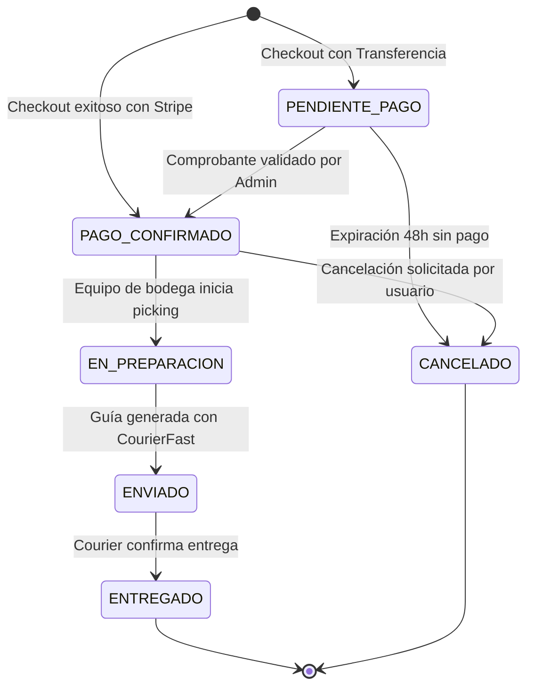

# 🔀 [STM-001] Diagrama de Estados: Ciclo de Vida del Pedido

```mermaid
stateDiagram-v2
    [*] --> PENDIENTE_PAGO: Checkout con Transferencia
    [*] --> PAGO_CONFIRMADO: Checkout exitoso con Stripe

    PENDIENTE_PAGO --> PAGO_CONFIRMADO: Comprobante validado por Admin
    PENDIENTE_PAGO --> CANCELADO: Expiración 48h sin pago

    PAGO_CONFIRMADO --> EN_PREPARACION: Equipo de bodega inicia picking
    PAGO_CONFIRMADO --> CANCELADO: Cancelación solicitada por usuario

    EN_PREPARACION --> ENVIADO: Guía generada con CourierFast
    
    ENVIADO --> ENTREGADO: Courier confirma entrega
    
    ENTREGADO --> [*]
    CANCELADO --> [*]
```
