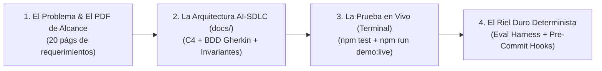

# 🎤 Guía de Presentación en Vivo: Demo ShopFast E-commerce

Esta guía proporciona el **guión paso a paso**, los **comandos exactos de terminal** y los **puntos clave de oratoria** para presentar esta demo ante CTOs, Tech Leads, Arquitectos y Desarrolladores.

---

## ⏱️ Estructura de la Presentación (10 - 15 Minutos)



---

## 🎬 Acto 1: La Ingestión del Alcance (2 Minutos)
* **Qué mostrar en pantalla:** Abrir [`Caso-Práctico-Documento-de-Alcance.pdf`](./Caso-Práctico-Documento-de-Alcance.pdf) y [`docs/INDEX.md`](./docs/INDEX.md).
* **Qué decir (Talking Points):**
  > *"Partimos de un documento de requerimientos real de 20 páginas de un cliente retail (ShopFast S.A.): 2,500 productos, checkout en 3 pasos, Stripe, CourierFast y alta concurrencia. En lugar de hacer 'Vibe Coding' y pedirle a la IA que 'haga una tienda', aplicamos el framework AI-SDLC: todo se modela primero en C4, casos de uso formales con BDD Gherkin y diagramas de secuencia Mermaid antes de tocar una sola línea de código."*

---

## 🎬 Acto 2: Verificación Determinista con Tests Reales (3 Minutos)
* **Comando a ejecutar en la terminal:**
  ```bash
  npm test
  ```
* **Salida esperada:**
  ```text
  ▶ 💳 [ShopFast] StripePaymentAdapter — PCI-DSS & Webhook Tests
    ✔ debe crear PaymentIntent sin tocar datos sensibles de tarjeta
    ✔ debe validar la firma criptográfica del webhook de Stripe
  ▶ 📦 [ShopFast] CatalogService — Search & Redis Cache L2 Tests
    ✔ debe buscar productos y almacenar en caché Redis L2
  ▶ 🛒 [ShopFast] OrderService — Checkout & Stock Reservation Tests
    ✔ debe aplicar costo de envío $0 cuando el subtotal supera $50,000 COP/MXN (Regla 3.3.2)
    ✔ debe cobrar tarifa de envío cuando el subtotal es menor a $50,000
  ℹ tests 5 | pass 5 | fail 0 (89ms)
  ```
* **Qué decir (Talking Points):**
  > *"Observen esto: aquí no hay un LLM diciendo 'creo que funciona'. Son aserciones matemáticas reales ejecutadas en Node.js en 89 milisegundos. Validamos que la regla de negocio 3.3.2 del PDF (envío gratis > $50,000) se cumpla con exactitud binaria."*

---

## 🎬 Acto 3: La Simulación de Compra en Vivo (4 Minutos)
* **Comando a ejecutar en la terminal:**
  ```bash
  npm run demo:live
  ```
* **Qué muestra:**
  1. `[1/4]` Búsqueda en catálogo con caché Redis L2 en **0.60ms**.
  2. `[2/4]` Cotización con CourierFast y aplicación automática de envío gratis.
  3. `[3/4]` Checkout en 3 pasos y creación del `PaymentIntent` tokenizado con Stripe (PCI-DSS delegado).
  4. `[4/4]` Recepción de webhook con firma criptográfica y reserva atómica de inventario (stock 15 ➔ 14 unidades).
* **Qué decir (Talking Points):**
  > *"Este script orquesta los módulos en Vertical Slices en tiempo real. Demuestra cómo el sistema cumple con los Requerimientos No Funcionales (NFRs): latencia ultra-baja (< 1s), consistencia transaccional ACID y seguridad financiera."*

---

## 🎬 Acto 4: El Eval Harness y el Riel Duro de Antigravity (3 Minutos)
* **Comando a ejecutar en la terminal:**
  ```bash
  npm run eval:task
  ```
* **Qué decir (Talking Points):**
  > *"Este es el Eval Harness basado en el paradigma SWE-bench y Reflexion (MIT/Princeton). El agente autónomo no da por cerrada la tarea hasta que este comando devuelva 'STATUS: PASSED 100%'. Si algo falla, el agente se auto-corrige en bucle cerrado. Esto es lo que hace que el desarrollo con IA sea predecible, gobernable y libre de alucinaciones."*
