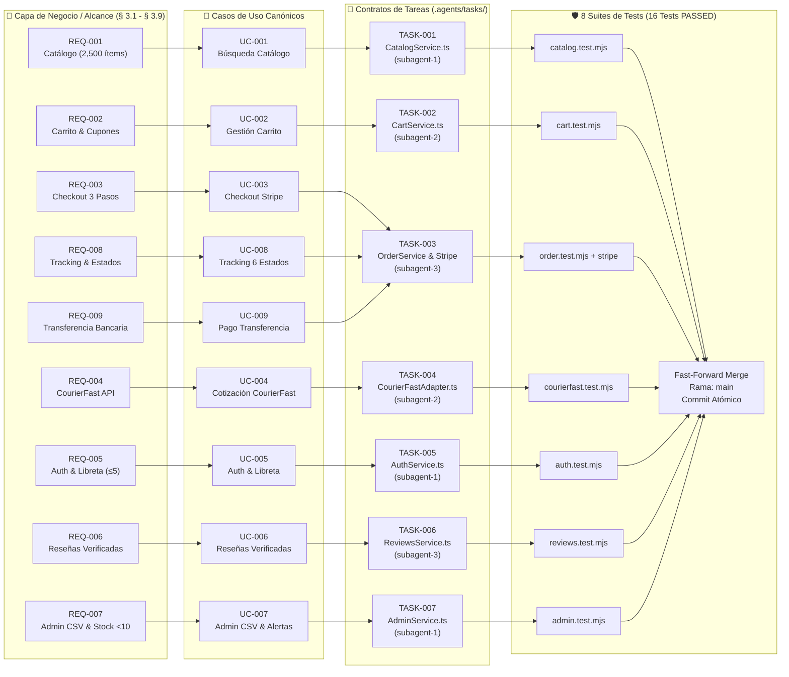

# 🕸️ [NET-001] Red de Trazabilidad y Dependencias de Casos de Uso

| Campo | Valor / Descripción |
| :--- | :--- |
| **Identificador:** | `NET-001` (Formato `NET-XXXX`, inmutable y secuencial) |
| **Objetivo del Documento:** | Mapeo de trazabilidad end-to-end desde Requerimientos de Negocio hasta Commits de Subagentes |
| **Audiencia:** | Tech Leads, Product Owners, Arquitectos y Subagentes IA |
| **Última Actualización:** | Septiembre 2026 |

---

## 1. Propósito de la Red de Trazabilidad

Este artefacto ofrece al **Tech Lead** y a los **Stakeholders de Negocio** una vista panorámica inmediata de:
1. Cómo se fragmentaron los requerimientos de alto nivel en **Casos de Uso Funcionales (`UC-XXXX`)**.
2. Qué **Contrato de Tarea (`TASK-XXXX`)** y **Subagente IA** implementó cada funcionalidad.
3. Qué **Git Worktree**, **Suite de Tests** y **Commit Atómico** respalda el entregable.

---

## 2. Grafo de Red de Trazabilidad (Mermaid — Cobertura 100% del Alcance)



---

## 3. Matriz de Auditoría y Estado de Trazabilidad Completa (100% Alcance)

| ID Requerimiento | ID Caso de Uso | ID Tarea Agente | Subagente Dueño | Componente Afectado | Suite de Test Determinista | Estado Final |
| :--- | :--- | :--- | :--- | :--- | :--- | :---: |
| **REQ-001** | [`UC-001`](../../use-cases/UC-001-busqueda-catalogo.md) | `TASK-001` | `subagent-1` | `src/modules/catalog/` | `catalog.service.test.mjs` | 🟢 VERIFIED |
| **REQ-002** | [`UC-002`](../../use-cases/UC-002-gestion-carrito.md) | `TASK-002` | `subagent-2` | `src/modules/cart/` | `cart.service.test.mjs` | 🟢 VERIFIED |
| **REQ-003** | [`UC-003`](../../use-cases/UC-003-checkout-stripe.md) | `TASK-003` | `subagent-3` | `src/modules/orders/` | `order.service.test.mjs` | 🟢 VERIFIED |
| **REQ-004** | [`UC-004`](../../use-cases/UC-004-cotizacion-envio-courierfast.md) | `TASK-004` | `subagent-2` | `src/integrations/shipping/` | `courierfast.adapter.test.mjs` | 🟢 VERIFIED |
| **REQ-005** | [`UC-005`](../../use-cases/UC-005-autenticacion-libreta-direcciones.md) | `TASK-005` | `subagent-1` | `src/modules/auth/` | `auth.service.test.mjs` | 🟢 VERIFIED |
| **REQ-006** | [`UC-006`](../../use-cases/UC-006-opiniones-compradores-verificados.md) | `TASK-006` | `subagent-3` | `src/modules/reviews/` | `reviews.service.test.mjs` | 🟢 VERIFIED |
| **REQ-007** | [`UC-007`](../../use-cases/UC-007-admin-dashboard-catalogo-csv.md) | `TASK-007` | `subagent-1` | `src/modules/admin/` | `admin.service.test.mjs` | 🟢 VERIFIED |
| **REQ-008** | [`UC-008`](../../use-cases/UC-008-ciclo-vida-pedidos-tracking.md) | `TASK-003` | `subagent-3` | `src/modules/orders/` | `order.service.test.mjs` | 🟢 VERIFIED |
| **REQ-009** | [`UC-009`](../../use-cases/UC-009-transferencia-bancaria-conciliacion.md) | `TASK-003` | `subagent-3` | `src/integrations/payments/` | `stripe.adapter.test.mjs` | 🟢 VERIFIED |

---

## 4. Guía para el Tech Lead: ¿Cómo auditar el avance?

1. **Revisión del Grafo:** Abre este diagrama para verificar si algún caso de uso tiene dependencias bloqueantes o circulares.
2. **Auditoría de Subagentes:** Consulta la tabla para saber con precisión qué subagente desarrolló cada módulo.
3. **Consistencia de Commits:** Cada commit atómico en `main` debe contener en su mensaje el formato:
   ```text
   feat(cart): [UC-002] [TASK-002] implement persistent cart and free shipping logic
   ```
