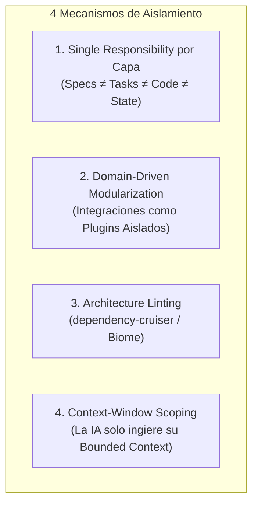
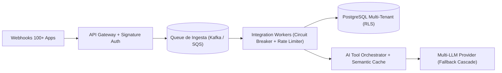

# 🏛️ Requerimientos No Funcionales (RNF) y Aislamiento para CRM de IA con 100+ Integraciones

Este documento define la arquitectura de blindaje, resiliencia y requerimientos no funcionales (NFRs) necesarios para diseñar y operar un **CRM con Inteligencia Artificial conectado a más de 100 herramientas SaaS** (Salesforce, HubSpot, Stripe, WhatsApp, Slack, Gmail, ERPs, etc.).

---

## 1. Los 4 Mecanismos de Blindaje Estructural

Para evitar que 100+ integraciones colisionen entre sí o degraden el núcleo del CRM:

1. **Responsabilidad Única por Artefacto:**
   - `docs/specs/`: Especificación funcional inmutable.
   - `.agents/tasks/`: Contrato de trabajo efímero para el ticket activo.
   - `.agents/rules/invariants.md`: Límites arquitectónicos inviolables.
   - `HANDOFF.md`: Snapshot vivo de sesión para el "yo futuro".
2. **Patrón de Arquitectura de Plugins:** Las 100+ integraciones se desacoplan mediante interfaces comunes (`IntegrationAdapter`) bajo `src/integrations/<dominio>/<herramienta>/`.
3. **Architecture Linting:** Reglas estáticas con `dependency-cruiser` que impiden importaciones cruzadas entre conectores externos.
4. **Context Scoping:** Cada agente de IA trabaja dentro del sandbox aislado de un conector específico sin cargar el código del resto del CRM.

---

## 2. Flujo de Ingesta y Procesamiento a Escala

---

## 3. Matriz de Requerimientos No Funcionales (NFRs)

### 3.1. Resiliencia & Tolerancia a Fallos (Bulkheading)
* **RNF-01 (Aislamiento de Fallos - Bulkhead):** La caída o indisponibilidad de un servicio externo (e.g. error 500 en WhatsApp o saturación en HubSpot) **NUNCA** debe bloquear los otros 99 conectores ni degradar el CRM central.
* **RNF-02 (Circuit Breakers & Exponential Backoff con Jitter):** Cada conector implementa un Circuit Breaker con 3 estados (*Closed, Open, Half-Open*) y reintentos exponenciales aleatorizados para evitar tormentas de reintentos.
* **RNF-03 (Dead Letter Queues - DLQ):** Eventos que fallen tras 5 reintentos se enrutan a una cola DLQ para inspección y reprocesamiento sin pérdida de datos.

### 3.2. Rate Limiting Distribuido & Cuotas Externas
* **RNF-04 (Throttling Multi-Tenant por Proveedor):** Gestión de cuotas mediante Token Bucket distribuido en Redis Cluster, adaptado a los límites individuales de cada API externa (e.g. límites de 10s en HubSpot vs rolling limits de 24h en Salesforce).

### 3.3. Seguridad, Tokens & Multi-Tenancy
* **RNF-05 (Atomic OAuth Token Refresh):** Bloqueo distribuido (*Redlock*) para que sólo un worker refresque un token OAuth2 expirado ante múltiples webhooks simultáneos, evitando condiciones de carrera e invalidaciones de sesión.
* **RNF-06 (Row-Level Security - RLS):** Aislamiento estricto multi-tenant a nivel de base de datos (`tenant_id` forzado en cada consulta SQL mediante PostgreSQL RLS).
* **RNF-07 (Zero-Knowledge Secrets Storage):** Tokens y credenciales cifrados en reposo mediante Envelope Encryption (AWS KMS / HashiCorp Vault).

### 3.4. Idempotencia y Concurrencia de Webhooks
* **RNF-08 (Ingesta Idempotente - At-Least-Once Delivery):** Ventana de deduplicación de 24 horas usando `idempotency_key` o hash del payload (`sha256(event_id + payload)`).
* **RNF-09 (Desacoplamiento de Ingesta < 50ms):** La API responde `202 Accepted` de inmediato tras validar la firma criptográfica y deposita el evento en una cola asíncrona.

### 3.5. Gobierno de IA, Costos y Latencia
* **RNF-10 (Semantic Caching):** Reutilización de respuestas LLM para intenciones repetidas mediante caché vectorial en Redis, reduciendo costos de inferencia en un 40-60%.
* **RNF-11 (Fallback Cascade Multi-LLM):** Enrutamiento inteligente en cascada:
  $$\text{Gemini 2.0 Flash} \longrightarrow \text{Claude 3.5 Sonnet} \longrightarrow \text{GPT-4o-mini} \longrightarrow \text{Modelo Local}$$
* **RNF-12 (PII Redaction en LLMs):** Enmascaramiento automático de información confidencial (tarjetas, DNI, passwords) antes de enviar prompts a proveedores de IA.

### 3.6. Observabilidad & Trazabilidad Distribuida
* **RNF-13 (OpenTelemetry Tracing):** Propagación de `TraceId` único desde el webhook entrante hasta la llamada de base de datos y la inferencia del LLM.
* **RNF-14 (Audit Trail Inmutable):** Registro auditado de cada acción autónoma ejecutada por un agente en el CRM.
