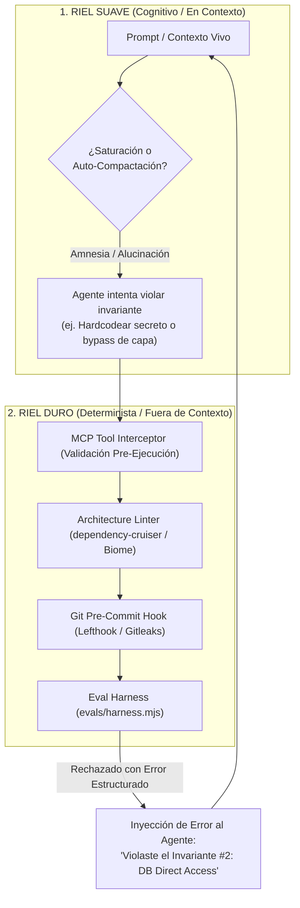
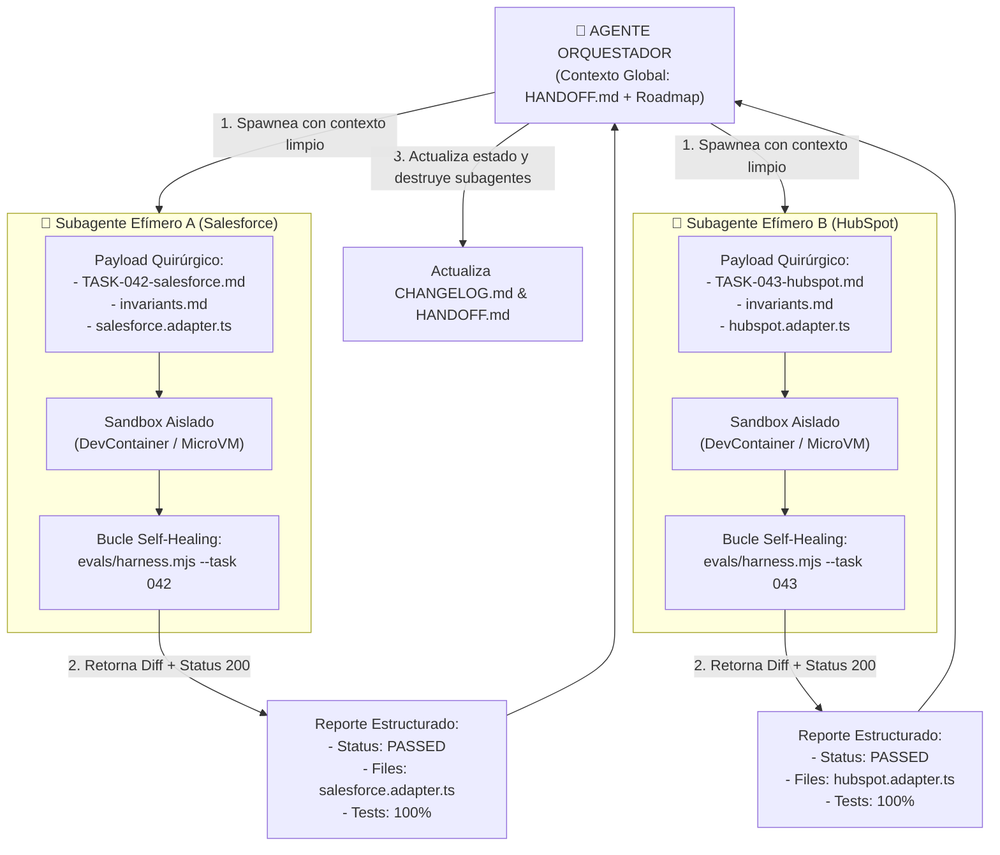
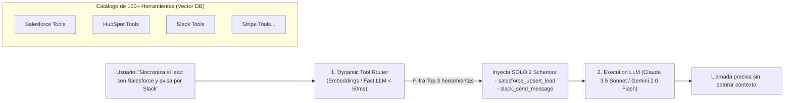

# 🧠 Gobernanza Inmune a la Amnesia de Contexto, Tokenomics de 100+ Herramientas y Garantías Multi-Plataforma

Este documento detalla cómo garantizar que los agentes de Inteligencia Artificial respeten las reglas arquitectónicas incluso bajo **saturación o auto-compactación de la ventana de contexto**, cómo diseñar **Tokenomics de alta eficiencia para más de 100 herramientas** y cómo implementarlo en **Antigravity IDE/CLI, Claude Code, Codex y Cursor**.

---

## 1. Blindaje Inmune a la Saturación y Auto-Compactación de Contexto

El contexto de los LLMs es volátil (saturación a partir de 40k–128k tokens, compactación agresiva y pérdida de atención en el medio). Para garantizar gobernanza inquebrantable, se implementa una **Arquitectura de Doble Riel**:



### Mecanismos del Riel Duro (Determinista)
1. **Linter de Arquitectura:** `dependency-cruiser` bloquea en tiempo de análisis cualquier importación indebida entre capas.
2. **Pre-commit Hooks Inmunes:** `Lefthook` ejecuta `gitleaks` (secretos), `tsc` (tipado) y `commitlint` (SemVer) antes de permitir un commit.
3. **Bloqueo Físico de Herramientas:** Si el agente ejecuta una acción no autorizada, el comando finaliza con código de error `1` y le retorna el mensaje explicativo para obligarlo a re-alinearse.

### Mecanismos del Riel Suave (Cognitivo Rehidratable)
1. **Invariantes Breves:** Las reglas maestras en `AGENTS.md` ocupan menos de 25 líneas para sobrevivir a resúmenes y compactaciones.
2. **State Checkpoints Inmutables (`HANDOFF.md`):** Al compactar, el modelo solo ingiere el snapshot de estado (< 300 tokens) sin reprocesar miles de líneas de historial previo.
3. **Subagentes Efímeros (Divide & Conquer & Zero-Context Pollution):**
   Las tareas complejas **NUNCA** deben ejecutarse en una única ventana de contexto monolítica. El agente orquestador divide el trabajo y despacha subagentes con ventanas de contexto limpias, aisladas y de un solo propósito.

---

### 🔬 1.3. Arquitectura Profunda de Subagentes Efímeros (Divide & Conquer)

Cuando un proyecto escala a más de 100 herramientas o módulos complejos, acumular 80 turnos de conversación en una sola ventana de contexto degrada exponencialmente la capacidad de razonamiento del LLM (*Attention Degradation*).



#### Reglas de Operación para Subagentes Efímeros:
1. **Zero-Pollution Payload (Inyección Quirúrgica de Contexto):**
   - El subagente nace con **0 tokens de historial de chat previo**.
   - Solo se le inyectan 3 archivos:
     - El contrato específico: `.agents/tasks/TASK-XXX.md`.
     - Las reglas no negociables: `.agents/rules/invariants.md`.
     - El archivo fuente del conector sobre el cual trabajará (e.g. `src/integrations/crm/salesforce.adapter.ts`).
2. **Límites de Presupuesto y Turnos (Circuit Breaker de Ejecución):**
   - Cada subagente tiene un límite estricto: máximo 15 turnos de herramientas o $0.50 USD de consumo de tokens.
   - Si tras 15 turnos no logra que `evals/harness.mjs` pase, el subagente se aborta, previene bucles infinitos y notifica al orquestador con el error exacto.
3. **Bubble-Up Estructurado (Retorno sin Ruido):**
   - El subagente no devuelve todo su monólogo interno al orquestador.
   - Al terminar, se destruye y solo emite un JSON estructurado:
     ```json
     {
       "taskId": "TASK-042",
       "status": "PASSED",
       "filesModified": ["src/integrations/crm/salesforce/salesforce.adapter.ts"],
       "testsPassed": 6,
       "diffSummary": "Added OAuth2 token refresh with Redlock distributed lock."
     }
     ```

---

## 2. Tokenomics, Costos y Latencia para 100+ Herramientas

Enviar 100 esquemas JSON/OpenAPI en cada turno consume 15,000–30,000 tokens por prompt, destruyendo la latencia y multiplicando los costos operativos.



### Los 4 Pilares del Tokenomics

| Pilar | Mecanismo | Impacto |
| :--- | :--- | :--- |
| **1. Dynamic Tool Selection** | Enrutador semántico de 2 fases (Vector Search filtra top 3 herramientas de 100). | **Reducción del 98.6%** en tokens de entrada (de 25k a ~350 tokens). |
| **2. Multi-LLM Tiering** | Tier 0 (Local/PII) $\rightarrow$ Tier 1 (Fast Router/Gemini Flash) $\rightarrow$ Tier 2 (Reasoning/Claude Sonnet). | Optimización de costo por token según complejidad. |
| **3. Semantic Caching 3-Layers** | L1 (Exact Redis Match) $\rightarrow$ L2 (Vector Similarity > 0.96) $\rightarrow$ L3 (Inferencia LLM). | **Ahorro del 40-60%** en consultas repetitivas de leads. |
| **4. Structured JSON Outputs** | Respuestas limitadas a esquemas Zod/Typebox sin texto conversacional superfluo. | Reducción de hasta un 70% en tokens de salida (los más costosos). |

---

## 3. Garantías de Implementación por Plataforma

Para que este framework opere de forma idéntica en cualquier cliente de desarrollo agéntico:

### 3.1. Antigravity IDE & Antigravity CLI (`agy`)
- **Customizations Root:** Configuración en `.agents/` (workspace) y `~/.gemini/config/` (global).
- **Rules Invariants:** Las reglas en `.agents/rules/invariants.md` se inyectan automáticamente en el sistema del modelo en cada invocación.
- **Skills On-Demand:** Cheatsheets y flujos en `.agents/skills/<nombre>/SKILL.md` cargados por demanda según el dominio activo.
- **Knowledge Items (KI):** Contexto pre-computado y persistido en `.gemini/antigravity-ide/knowledge` que sobrevive reinicios.
- **Spawneo de Subagentes:** Uso nativo de herramientas de subagentes para bifurcar tareas complejas en hilos independientes.

### 3.2. Claude Code
- **`CLAUDE.md` en Raíz:** Actúa como memoria raíz inmutable que sobrevive a comandos `/compact`.
- **Slash Commands (`.claude/commands/`):** Comandos `/eval`, `/handoff` y `/check-invariants` automatizados.
- **Micro-Context Pruning:** Ejecución en terminales sandboxed con reinicio de contexto entre tareas mayores.

### 3.3. Codex / Prime-Agent / Pi / Cursor
- **`.cursorrules` / `.codex/rules`:** Configuración basada en patrones glob (`src/integrations/**` $\rightarrow$ inyecta `invariants.md` y `IntegrationAdapter`).
- **Model Context Protocol (MCP):** Herramientas expuestas vía `mcp-servers.json` que validan tipado antes de interactuar con el sistema operativo.
- **El Guardián Universal (Git Hooks + CI):** Pre-commit hooks (`Lefthook` + `dependency-cruiser` + `gitleaks` + `evals/harness.mjs`) que bloquean cualquier violación independientemente de si el cliente de IA respetó o no las instrucciones.

---

## 📌 Fórmula de Gobernanza y Eficiencia

$$\text{Gobernanza Confiable} = \underbrace{\text{Invariantes Breves}}_{\text{Fácil de recordar}} + \underbrace{\text{Subagentes Aislados}}_{\text{Contexto limpio}} + \underbrace{\text{Gates Deterministas (Linter/Hooks)}}_{\text{Imposible de violar}}$$

$$\text{Tokenomics Eficiente} = \underbrace{\text{Enrutamiento Vectorial de Tools}}_{\text{Solo 3 de 100 herramientas}} + \underbrace{\text{Semantic Cache}}_{\text{Cero costo en repetidos}} + \underbrace{\text{Multi-LLM Tiering}}_{\text{Modelo adecuado por tarea}}$$
