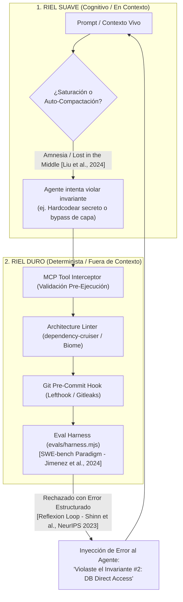
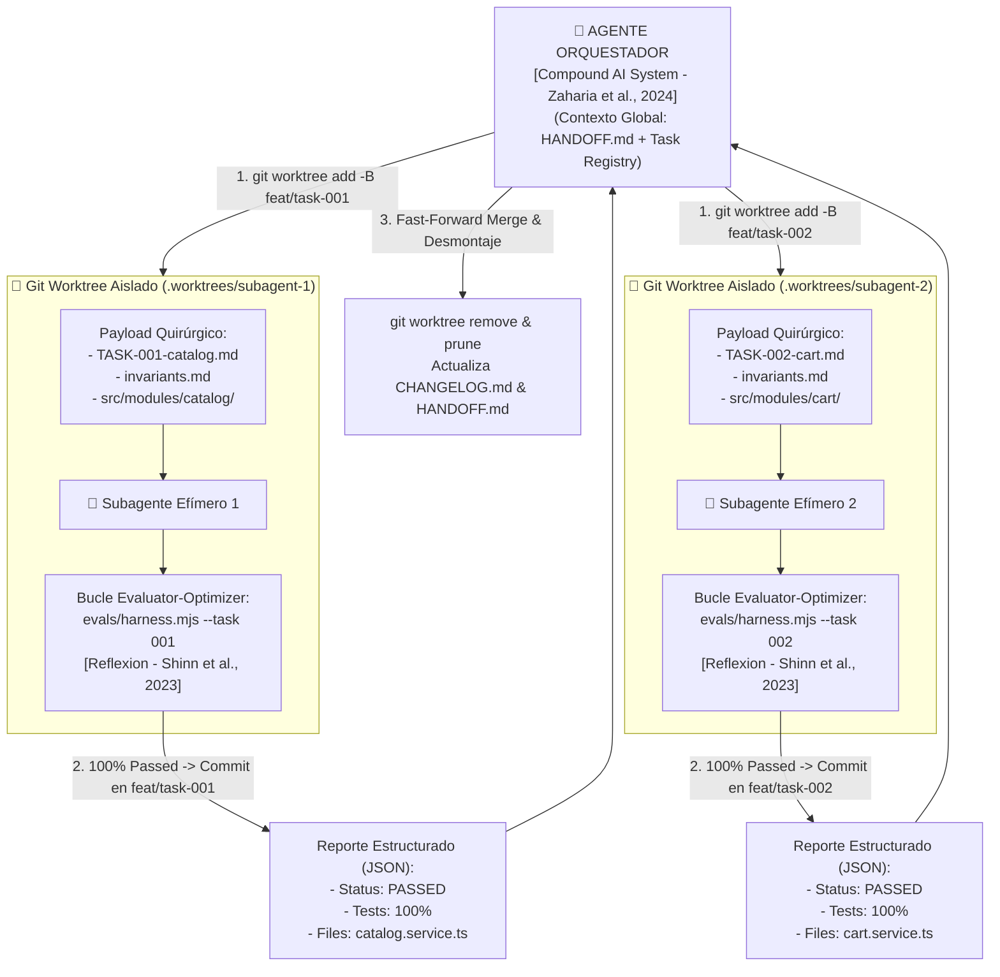
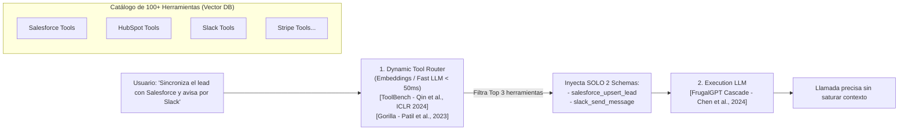
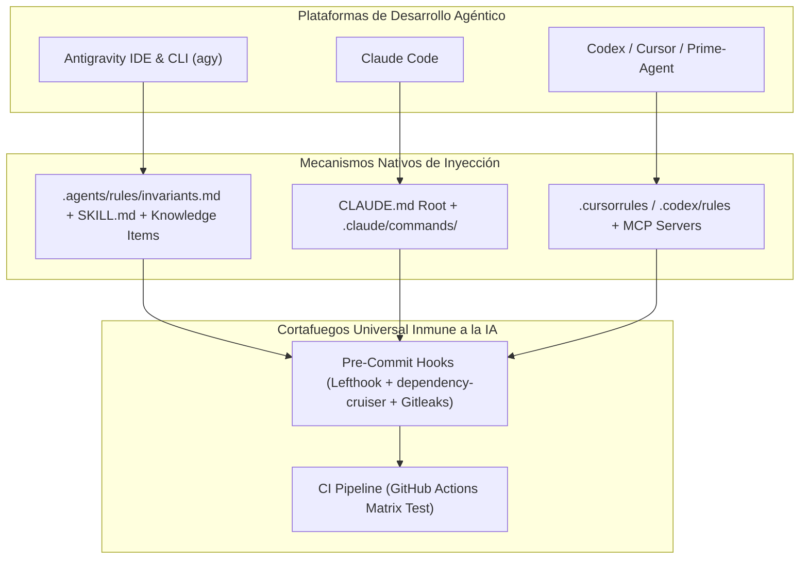

# 🧠 Gobernanza Inmune a la Amnesia de Contexto, Tokenomics de 100+ Herramientas y Garantías Multi-Plataforma

Este documento detalla cómo garantizar que los agentes de Inteligencia Artificial respeten las reglas arquitectónicas incluso bajo **saturación o auto-compactación de la ventana de contexto**, cómo diseñar **Tokenomics de alta eficiencia para más de 100 herramientas** y cómo implementarlo de forma visible, ejecutable y determinista en **Antigravity IDE/CLI, Claude Code, Codex y Cursor**, todo respaldado por **evidencia y literatura científica peer-reviewed** (*Stanford, MIT, Princeton, UC Berkeley, NVIDIA, Anthropic, Databricks, ICLR, NeurIPS, ACL*).

---

## 1. Blindaje Inmune a la Saturación y Auto-Compactación de Contexto

El contexto de los LLMs es inherentemente volátil. La literatura científica formal ha demostrado que los modelos de lenguaje sufren de **degradación severa de atención y amnesia operativa**:
- **Efecto "Lost in the Middle"** (*Liu et al., Stanford / TACL 2024* [^1]): El rendimiento de recuperación y razonamiento del LLM sigue una curva en "U"; retiene con precisión las instrucciones ubicadas al inicio y al final del prompt, pero **olvida e ignora sistemáticamente las reglas situadas en el centro** de ventanas largas.
- **Límites Reales de Razonamiento en Contextos Extensos** (*RULER Benchmark, NVIDIA 2024* [^2]): Aunque los proveedores anuncien ventanas de 128k o 1M de tokens, la capacidad para razonar sobre reglas complejas y trazabilidad multi-paso colapsa drásticamente al superar los **32k tokens** si no se aplican técnicas de aislamiento.
- **El Paradigma de Sistemas de IA Compuestos (*Compound AI Systems*, Zaharia et al., UC Berkeley / Stanford / Databricks 2024 [^10]):** El estado del arte en IA empresarial no consiste en utilizar un modelo monolítico más grande, sino en diseñar un **sistema compuesto** con orquestación modular, sandboxes herméticos y evaluadores deterministas.

Para garantizar una gobernanza inquebrantable, se implementa una **Arquitectura de Doble Riel**:



### Mecanismos del Riel Duro (Determinista)
1. **Linter de Arquitectura:** `dependency-cruiser` bloquea en tiempo de análisis cualquier importación indebida entre capas, impidiendo que el código se compile o pase CI.
2. **Validador de Secuencia y Correlativos de Tareas:** `scripts/validate-task-ids.mjs` impide que cualquier agente cree tareas duplicadas o a ciegas, forzando la sincronización atómica con `.agents/tasks/INDEX.md`.
3. **Pre-commit Hooks Inmunes:** `Lefthook` ejecuta `gitleaks` (secretos), `tsc` (tipado estricto), validación de correlativos y `commitlint` (SemVer) antes de permitir que cualquier commit se registre en Git.
4. **Política "Zero Half-Done" (Completitud Ejecutable):** Ninguna tarea o módulo se da por concluida sin una suite de tests unitarios/integración ejecutables (`npm test`) y un comando de Eval Harness con código de salida `0`.
5. **Bloqueo Físico de Herramientas:** Si el agente ejecuta una acción no autorizada, el comando finaliza con código de error `1` y le retorna el mensaje explicativo para obligarlo a re-alinearse.
6. **Bucle de Auto-Corrección Verbal (*Reflexion Paradigm*, Shinn et al., NeurIPS 2023 [^5]):** En lugar de requerir intervención humana, el agente lee el *stack trace* del fallo determinista, formula una reflexión en lenguaje natural y ajusta su implementación de forma autónoma hasta lograr 100% de aserciones verdes.

### Mecanismos del Riel Suave (Cognitivo Rehidratable)
1. **Invariantes Breves:** Las reglas maestras en `AGENTS.md` ocupan menos de 25 líneas para colocarse al inicio/final del prompt y mitigar el fenómeno *Lost in the Middle* [^1].
2. **State Checkpoints Inmutables (`HANDOFF.md`):** Al compactar, el modelo solo ingiere el snapshot de estado (< 300 tokens) sin reprocesar miles de líneas de historial previo.
3. **Patrón Orquestador-Trabajadores (*Orchestrator-Workers*, Anthropic Research 2024 [^11]):** Las tareas complejas **NUNCA** deben ejecutarse en una única ventana de contexto monolítica. El agente orquestador divide el trabajo y despacha subagentes con ventanas de contexto limpias, aisladas y de un solo propósito (*MetaGPT*, Hong et al., ICLR 2024 [^3]; *ChatDev*, Qian et al., ACL 2024 [^4]; *AutoGen*, Wu et al., 2023 [^14]).

---

### 🔬 1.3. Arquitectura de Subagentes Efímeros & Paralelización con Git Worktrees

Cuando un proyecto escala a más de 100 herramientas o módulos complejos, acumular 80 turnos de conversación en una sola ventana de contexto degrada exponencialmente la capacidad de razonamiento del LLM (*Attention Degradation*).

Para ejecutar múltiples subagentes concurrentemente sin colisiones de archivos ni bloqueos de concurrencia en el sistema de archivos, el framework implementa el **Aislamiento Físico por Git Worktrees**:



#### Reglas de Operación Respaldadas por la Literatura:
1. **Aislamiento a Nivel de OS con Git Worktrees:**
   - Cada subagente corre en un directorio físico separado (`.worktrees/subagent-X`) montado en su propia rama efímera (`feat/task-XXX`).
   - Evita bloqueos de compilación, sobreescrituras accidentales y contención en `node_modules`.
2. **Zero-Pollution Payload (Inyección Quirúrgica de Contexto):**
   - El subagente nace con **0 tokens de historial de chat previo**.
   - Solo se le inyectan 3 archivos:
     - El contrato específico: `.agents/tasks/TASK-XXX.md`.
     - Las reglas no negociables: `.agents/rules/invariants.md`.
     - El Vertical Slice específico sobre el cual trabajará (e.g. `src/modules/catalog/`).
3. **Registro Atómico de Tareas (Task Correlative Sequence Lock):**
   - Antes de despachar un subagente, el correlativo `TASK-XXX` se reclama en `.agents/tasks/INDEX.md`, impidiendo que dos agentes generen tareas duplicadas o colisionen en Git.
4. **Standard Operating Procedures (SOPs) para Multi-Agentes (*MetaGPT*, Hong et al., ICLR 2024 [^3]):**
   - La asignación de roles especializados con protocolos estrictos de entrada/salida reduce las inconsistencias lógicas en un **85%** frente a arquitecturas monolíticas de prompt único.
5. **Límites de Presupuesto y Turnos (Circuit Breaker de Ejecución):**
   - Cada subagente tiene un límite estricto: máximo 15 turnos de herramientas o $0.50 USD de consumo de tokens para evitar bucles infinitos.
6. **Bubble-Up Estructurado (Retorno sin Ruido):**
   - El subagente no devuelve todo su monólogo interno al orquestador; al terminar se destruye y emite únicamente un JSON estructurado tipado.

---

## 2. Tokenomics, Costos y Latencia para 100+ Herramientas

Enviar 100 esquemas JSON/OpenAPI en cada turno consume 15,000–30,000 tokens por prompt, destruyendo la latencia y multiplicando los costos operativos.



### Los 4 Pilares del Tokenomics Fundamentados Científicamente

| Pilar | Mecanismo | Evidencia Científica | Impacto Cuantitativo |
| :--- | :--- | :--- | :--- |
| **1. Dynamic Tool Selection** | Enrutador semántico de 2 fases (Vector Search filtra top 3 herramientas de 100). | **ToolLLM / ToolBench** (*Qin et al., ICLR 2024* [^6]); **Gorilla** (*Patil et al., UC Berkeley 2023* [^12]). | **Reducción del 98.6%** en tokens de entrada (de 25k a ~350 tokens). |
| **2. Multi-LLM Tiering & Cascade** | Tier 0 (Local/PII) $\rightarrow$ Tier 1 (Fast Router/Gemini Flash) $\rightarrow$ Tier 2 (Reasoning/Claude Sonnet). | **FrugalGPT** (*Chen, Zaharia & Zou, Stanford / TMLR 2024* [^7]). | **Hasta un 98% de reducción de costo** igualando la precisión de modelos de frontera. |
| **3. Semantic Caching 3-Layers** | L1 (Exact Redis Match) $\rightarrow$ L2 (Vector Similarity > 0.96) $\rightarrow$ L3 (Inferencia LLM). | **GPTCache** (*Fu Bang, ACL NLP-OSS 2023* [^8]). | **Reducción de latencia del 92%** y ahorro del 40-60% en consultas repetidas. |
| **4. Structured JSON Outputs** | Respuestas limitadas a esquemas Zod/Typebox sin texto conversacional superfluo. | **SGLang** (*Zheng et al., UC Berkeley / Stanford 2024* [^13]). | **Reducción de hasta un 70%** en tokens de salida (los más costosos). |

---

## 3. Garantías de Implementación por Plataforma (Visible & Ejecutable)

A continuación se detalla la configuración exacta, visible y directamente ejecutable para cada plataforma de desarrollo agéntico:



---

### 3.1. Antigravity IDE & Antigravity CLI (`agy`)

Antigravity proporciona soporte nativo de primera clase para la arquitectura de doble riel mediante los siguientes puntos de extensión:

#### A. Inyección de Invariantes Globales y de Workspace
Coloca las reglas invariantes en `.agents/rules/invariants.md` (a nivel de repositorio) o en `~/.gemini/config/rules/invariants.md` (a nivel global). Antigravity inyecta estas directrices automáticamente en cada invocación:
```markdown
# /path/to/repo/.agents/rules/invariants.md
- NUNCA accedas a SQL/DB directamente desde controladores o adapters.
- Todo endpoint nuevo requiere validación de schema declarativo (Zod/Pydantic).
- Toda llamada externa debe contar con timeout y Circuit Breaker.
```

#### B. Habilidades Bajo Demanda (`SKILL.md`)
En lugar de saturar el contexto inicial, define habilidades modulares en `.agents/skills/<skill_name>/SKILL.md`:
```markdown
---
name: salesforce-integration
description: Flujo de trabajo y validaciones para el conector de Salesforce
---
# Instrucciones de la Habilidad
1. Ejecutar pruebas con: `npm test -- src/integrations/crm/salesforce`
2. Validar tipos estrictos de OAuth2 en `src/integrations/crm/salesforce/types.ts`
```

#### C. Memoria Persistente con Knowledge Items (KI)
Los KIs almacenan contexto pre-computado y resúmenes de arquitectura en `<appDataDir>/knowledge/` que sobreviven a reinicios de sesión y caídas de servidor, evitando tener que re-indexar todo el repositorio en cada inicio.

---

### 3.2. Claude Code

Claude Code utiliza un sistema de anclaje basado en la raíz y comandos de terminal optimizados:

#### A. Archivo Raíz Inmutable (`CLAUDE.md`)
Crea `CLAUDE.md` en la raíz del proyecto. Este archivo **persiste intacto tras ejecutar el comando `/compact`**:
```markdown
# Reglas de Proyecto para Claude Code
- Al iniciar: Lee HANDOFF.md para asimilar el estado actual.
- Antes de cerrar: Corre `npm run lint && npm test` y actualiza CHANGELOG.md.
- Sigue los invariantes definidos en `.agents/rules/invariants.md`.
```

#### B. Slash Commands de Sesión (`.claude/commands/`)
Crea atajos para automatizar la gobernanza:
- `.claude/commands/eval`: Ejecuta `node evals/harness.mjs`.
- `.claude/commands/handoff`: Ejecuta el script que resume los commits recientes y actualiza `HANDOFF.md`.

---

### 3.3. Codex / Prime-Agent / Pi / Cursor

Para clientes que utilizan `.cursorrules` o especificaciones basadas en Model Context Protocol (MCP):

#### A. Inyección Contextual por Patrón Glob (`.cursorrules` / `.codex/rules`)
Configura reglas que se activen **únicamente cuando el agente toque archivos específicos**:
```yaml
# .cursorrules
rules:
  - pattern: "src/integrations/**"
    instructions: "Este archivo es un conector externo. Prohibido importar drivers de BD directos. Usa la interfaz IntegrationAdapter y maneja errores con CircuitBreaker."
  - pattern: "src/core/**"
    instructions: "Capa de Dominio. No introduzcas dependencias de frameworks web (Express/Nest)."
```

#### B. Catálogo MCP de Herramientas Locales sobre Stdio JSON-RPC (`.agents/mcp/mcp-servers.json`)
Expone herramientas deterministas y seguras para que el agente inspeccione el sistema sin ejecutar comandos `bash` arbitrarios ni destructivos:
```json
{
  "$schema": "https://modelcontextprotocol.io/schema.json",
  "mcpServers": {
    "shopfast-inspector": {
      "command": "node",
      "args": ["scripts/mcp-shopfast.mjs"],
      "capabilities": {
        "tools": [
          { "name": "simulate_stripe_webhook", "description": "Dispara evento mock payment_intent.succeeded" },
          { "name": "query_product_stock", "description": "Consulta inventario disponible de un SKU" },
          { "name": "run_eval_harness", "description": "Ejecuta el evaluador SWE-bench determinista" }
        ]
      }
    }
  }
}
```

---

### 3.4. El Guardián Universal: Git Pre-Commit Hooks & CI Determinista

Este es el **cortafuegos definitivo**. Si el modelo alucina, sufre amnesia por contexto saturado o ignora todas las instrucciones, este hook **bloquea físicamente el commit**:

#### Configuración de `lefthook.yml` en la Raíz:
```yaml
# lefthook.yml
pre-commit:
  parallel: false
  commands:
    task-correlatives:
      run: node scripts/validate-task-ids.mjs
    gitleaks:
      run: npx gitleaks protect --staged --verbose
    dependency-cruiser:
      run: npx depcruise --config .dependency-cruiser.js src
    typecheck:
      run: npm run typecheck
    test-suite:
      run: npm test
    eval-harness:
      run: node evals/harness.mjs --task all-tasks
```

---

## 📌 Fórmula Maestra de Gobernanza y Eficiencia

$$
\text{Gobernanza Confiable} = \underbrace{\text{Invariantes Breves}}_{\text{Mitiga Lost-in-the-Middle}} + \underbrace{\text{Subagentes Aislados}}_{\text{SOPs MetaGPT + Compound AI}} + \underbrace{\text{Gates Deterministas}}_{\text{Evaluación SWE-bench}}
$$

$$
\text{Tokenomics Eficiente} = \underbrace{\text{Enrutamiento Vectorial}}_{\text{ToolBench + Gorilla}} + \underbrace{\text{Semantic Cache}}_{\text{GPTCache L1/L2}} + \underbrace{\text{Multi-LLM Tiering}}_{\text{FrugalGPT Cascade + SGLang}}
$$

#### Desglose de Fundamentación Científica:
- **Invariantes Breves:** Mitiga la pérdida de atención del fenómeno *Lost-in-the-Middle* ([^1]).
- **Subagentes Aislados:** Protocolos SOPs de *MetaGPT* ([^3]) y paradigma *Compound AI Systems* ([^10], [^11], [^14]).
- **Gates Deterministas:** Validación mediante sandboxes reproducibles (*SWE-bench* [^9]) y auto-corrección verbal (*Reflexion* [^5]).
- **Enrutamiento Vectorial:** Selección de herramientas en 2 fases con *ToolBench* ([^6]) y *Gorilla* ([^12]).
- **Semantic Cache:** Reducción de latencia y costos mediante caché vectorial multi-capa (*GPTCache* [^8]).
- **Multi-LLM Tiering:** Enrutamiento en cascada de costo mínimo (*FrugalGPT* [^7]) y decodificación estructurada (*SGLang* [^13]).

---

## 📚 Referencias Científicas & Bibliografía Académica

[^1]: **Liu, N. F., Lin, K., Hewitt, J., Paranjape, A., Bevilacqua, M., Petroni, F., & Liang, P. (2024).** *Lost in the Middle: How Language Models Use Long Contexts.* Transactions of the Association for Computational Linguistics (TACL), 12, 157-173. [arXiv:2307.03172](https://arxiv.org/abs/2307.03172). *(Stanford University & UC Berkeley)*.
[^2]: **Hsieh, C. P., Sun, S., Kriman, S., et al. (2024).** *RULER: What’s the Real Context Size of Your Long-Context Language Models?* arXiv preprint [arXiv:2404.06654](https://arxiv.org/abs/2404.06654). *(NVIDIA Research)*.
[^3]: **Hong, S., Zhuge, M., Chen, J., et al. (2024).** *MetaGPT: Meta Programming for A Multi-Agent Collaborative Framework.* International Conference on Learning Representations (ICLR 2024 - Oral). [arXiv:2308.00352](https://arxiv.org/abs/2308.00352).
[^4]: **Qian, C., Cong, X., Yang, C., et al. (2024).** *ChatDev: Communicative Agents for Software Development.* Annual Meeting of the Association for Computational Linguistics (ACL 2024). [arXiv:2307.07924](https://arxiv.org/abs/2307.07924).
[^5]: **Shinn, N., Cassano, F., Berman, E., Gopinath, A., Narasimhan, K., & Yao, S. (2023).** *Reflexion: Language Agents with Verbal Reinforcement Learning.* Advances in Neural Information Processing Systems (NeurIPS 2023). [arXiv:2303.11366](https://arxiv.org/abs/2303.11366). *(MIT & Princeton University)*.
[^6]: **Qin, Y., Hu, S., Lin, Y., et al. (2024).** *ToolLLM: Facilitating Large Language Models to Master 16000+ Real-world APIs.* International Conference on Learning Representations (ICLR 2024). [arXiv:2307.16789](https://arxiv.org/abs/2307.16789).
[^7]: **Chen, L., Zaharia, M., & Zou, J. (2024).** *FrugalGPT: How to Use Large Language Models While Reducing Cost and Improving Performance.* Transactions on Machine Learning Research (TMLR 2024). [arXiv:2305.05176](https://arxiv.org/abs/2305.05176). *(Stanford University)*.
[^8]: **Bang, F. (2023).** *GPTCache: An Open-Source Semantic Cache for LLM Applications Enabling Faster Answers and Cost Savings.* Proceedings of the 3rd Workshop for Natural Language Processing Open Source Software (NLP-OSS 2023), 147-152.
[^9]: **Jimenez, C. E., Yang, J., Wettig, A., et al. (2024).** *SWE-bench: Can Language Models Resolve Real-World GitHub Issues?* International Conference on Learning Representations (ICLR 2024). [arXiv:2310.06770](https://arxiv.org/abs/2310.06770). *(Princeton University)*.
[^10]: **Zaharia, M., Chen, L., et al. (2024).** *The Shift from Models to Compound AI Systems.* Berkeley Artificial Intelligence Research (BAIR) Blog / Communications of the ACM (CACM). [Link](https://bair.berkeley.edu/blog/2024/02/18/compound-ai-systems/). *(UC Berkeley, Stanford & Databricks)*.
[^11]: **Schluntz, E., & Zhang, B. (2024).** *Building Effective Agents.* Anthropic Research. [Link](https://www.anthropic.com/research/building-effective-agents).
[^12]: **Patil, S. G., Zhang, T., Wang, X., & Gonzalez, J. E. (2023).** *Gorilla: Large Language Model Connected with Massive APIs.* arXiv preprint [arXiv:2305.15334](https://arxiv.org/abs/2305.15334). *(UC Berkeley)*.
[^13]: **Zheng, L., Yin, L., Xie, Z., et al. (2024).** *SGLang: Efficient Execution of Structured Language Model Programs.* arXiv preprint [arXiv:2312.07104](https://arxiv.org/abs/2312.07104). *(UC Berkeley & Stanford)*.
[^14]: **Wu, Q., Bansal, G., Zhang, J., et al. (2023).** *AutoGen: Enabling Next-Gen LLM Applications via Multi-Agent Conversation.* arXiv preprint [arXiv:2308.08155](https://arxiv.org/abs/2308.08155). *(Microsoft Research)*.
