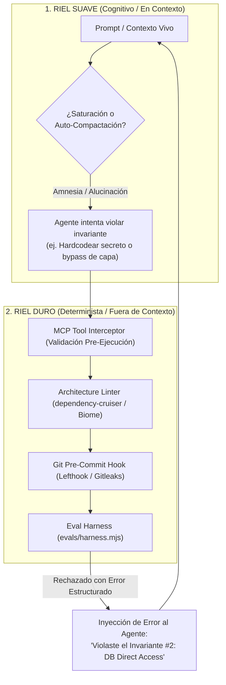
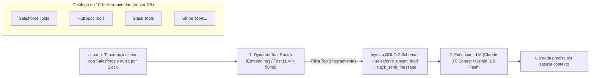

# 🧠 Gobernanza Inmune a la Amnesia de Contexto, Tokenomics de 100+ Herramientas y Garantías Multi-Plataforma

Este documento detalla cómo garantizar que los agentes de Inteligencia Artificial respeten las reglas arquitectónicas incluso bajo **saturación o auto-compactación de la ventana de contexto**, cómo diseñar **Tokenomics de alta eficiencia para más de 100 herramientas** y cómo implementarlo en **Antigravity IDE/CLI, Claude Code, Codex y Cursor**.

---

## 1. Blindaje Inmune a la Saturación y Auto-Compactación de Contexto

El contexto de los LLMs es volátil (saturación a partir de 40k–128k tokens, compactación agresiva y pérdida de atención en el medio). Para garantizar gobernanza inquebrantable, se implementa una **Arquitectura de Doble Riel**:



### Mecanismos del Riel Duro (Determinista)
1. **Linter de Arquitectura:** `dependency-cruiser` bloquea en tiempo de análisis cualquier importación indebida entre capas.
2. **Pre-commit Hooks Inmunes:** `Lefthook` ejecuta `gitleaks` (secretos), `tsc` (tipado) y `commitlint` (SemVer) antes de permitir un commit.
3. **Bloqueo Físico de Herramientas:** Si el agente ejecuta una acción no autorizada, el comando finaliza con código de error `1` y le retorna el mensaje explicativo para obligarlo a re-alinearse.

### Mecanismos del Riel Suave (Cognitivo Rehidratable)
1. **Invariantes Breves:** Las reglas maestras en `AGENTS.md` ocupan menos de 25 líneas para sobrevivir a resúmenes y compactaciones.
2. **State Checkpoints Inmutables (`HANDOFF.md`):** Al compactar, el modelo solo ingiere el snapshot de estado (< 300 tokens) sin reprocesar miles de líneas de historial previo.
3. **Subagentes Efímeros (Divide & Conquer):** Las tareas complejas se delegan a subagentes con ventanas de contexto limpias que contienen únicamente `TASK-XXX.md` y el conector específico.

---

## 2. Tokenomics, Costos y Latencia para 100+ Herramientas

Enviar 100 esquemas JSON/OpenAPI en cada turno consume 15,000–30,000 tokens por prompt, destruyendo la latencia y multiplicando los costos operativos.



### Los 4 Pilares del Tokenomics

| Pilar | Mecanismo | Impacto |
| :--- | :--- | :--- |
| **1. Dynamic Tool Selection** | Enrutador semántico de 2 fases (Vector Search filtra top 3 herramientas de 100). | **Reducción del 98.6%** en tokens de entrada (de 25k a ~350 tokens). |
| **2. Multi-LLM Tiering** | Tier 0 (Local/PII) $\rightarrow$ Tier 1 (Fast Router/Gemini Flash) $\rightarrow$ Tier 2 (Reasoning/Claude Sonnet). | Optimización de costo por token según complejidad. |
| **3. Semantic Caching 3-Layers** | L1 (Exact Redis Match) $\rightarrow$ L2 (Vector Similarity > 0.96) $\rightarrow$ L3 (Inferencia LLM). | **Ahorro del 40-60%** en consultas repetitivas de leads. |
| **4. Structured JSON Outputs** | Respuestas limitadas a esquemas Zod/Typebox sin texto conversacional superfluo. | Reducción de hasta un 70% en tokens de salida (los más costosos). |

---

## 3. Garantías de Implementación por Plataforma

```markdown
| Plataforma / Entorno | Mecanismo de Garantía Inmune a la Compactación |
| :--- | :--- |
| **Antigravity IDE & agy CLI** | • Rules Globales y de Workspace (`.agents/rules/invariants.md`).<br>• Skills On-Demand (`.agents/skills/<name>/SKILL.md`).<br>• Knowledge Items (KI) cacheados que sobreviven a reinicios.<br>• Spawneo de subagentes aislados con contexto limpio. |
| **Claude Code** | • `CLAUDE.md` en raíz (persiste tras `/compact`).<br>• Slash commands (`.claude/commands/`) para recolección de contexto.<br>• Sandboxing estricto de herramientas CLI. |
| **Codex / Prime-Agent / Pi / Cursor** | • `.cursorrules` / `.codex/rules` inyectadas por patrón de archivo.<br>• Model Context Protocol (MCP) que valida esquemas de tools.<br>• Guardián universal: Git Hooks (Lefthook) + CI Gates. |
```

---

## 📌 Fórmula de Gobernanza y Eficiencia

$$\text{Gobernanza Confiable} = \underbrace{\text{Invariantes Breves}}_{\text{Fácil de recordar}} + \underbrace{\text{Subagentes Aislados}}_{\text{Contexto limpio}} + \underbrace{\text{Gates Deterministas (Linter/Hooks)}}_{\text{Imposible de violar}}$$

$$\text{Tokenomics Eficiente} = \underbrace{\text{Enrutamiento Vectorial de Tools}}_{\text{Solo 3 de 100 herramientas}} + \underbrace{\text{Semantic Cache}}_{\text{Cero costo en repetidos}} + \underbrace{\text{Multi-LLM Tiering}}_{\text{Modelo adecuado por tarea}}$$
