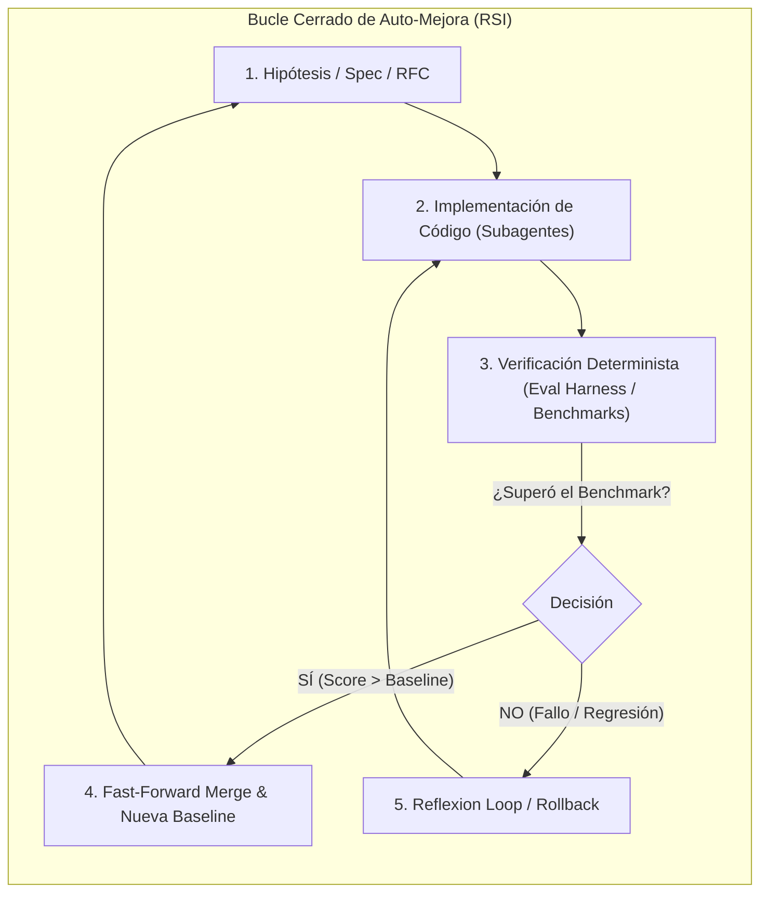
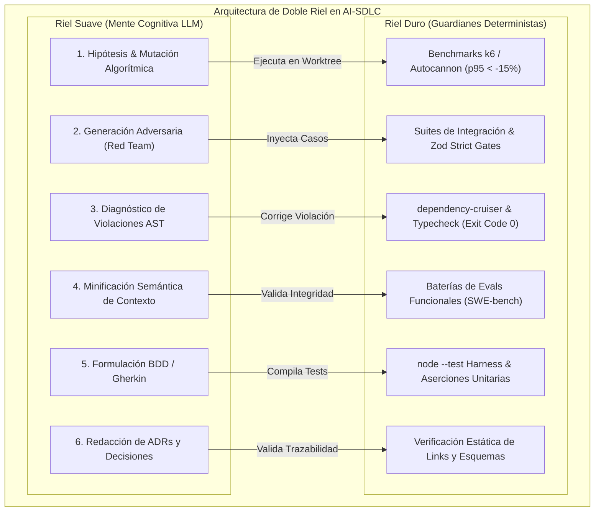

# 🧠 SOTA-001: Recursive Self-Improvement (RSI), Auto-Research y la Gobernanza en Bucles Cerrados de IA

- **Fecha:** 28 de Mayo de 2026 (Actualizado Septiembre 2026)
- **Categoría:** Estado del Arte / Arquitectura de Sistemas Compuestos / Auto-Mejora Recursiva
- **Fuentes Principales:**
  - *TechCrunch:* *"RSI is the new AGI — and it's just as hard to pin down"* (Russell Brandom, Mayo 2026) [^1]
  - *Andrej Karpathy:* Proyecto *Auto-Research* & Swarm Pre-training en Anthropic [^2]
  - *METR (Model Evaluation and Threat Research):* *"Six Milestones for AI Automation"* (Ajeya Cotra) [^3]
  - *Anthropic Research:* Internal Report on Claude Code & Mythos L4 Evaluation [^4]
  - *Georgetown CSET:* *"When AI Builds AI"* (Helen Toner et al.) [^5]
  - *Disarray AI:* *"When an MLE Agent Beats Humans: The Meat-and-Potatoes Engineering of AI"* (Doris Xin) [^6]

---

## 1. Contexto y Definición: ¿Qué es RSI y por qué reemplaza la narrativa de AGI?

El término **AGI (*Artificial General Intelligence*)** ha demostrado ser ambiguo y difícil de medir operativamente. En la frontera de investigación (Anthropic, OpenAI, DeepMind, Sakana AI, Adaption), el foco ha migrado hacia **RSI (*Recursive Self-Improvement* o Auto-Mejora Recursiva)**:

> **Definición Formal de RSI:**  
> La capacidad de un sistema de IA para gestionar el ciclo completo de **ideación, implementación, verificación y despliegue de mejoras sobre sí mismo o sobre bases de código complejas en un bucle cerrado sin intervención humana**.

---

## 2. Los 3 Hitos de Automatización de METR (Ajeya Cotra)

El reporte de METR (*Model Evaluation and Threat Research*) define tres estadios de transición en la ingeniería autónoma:

1. **Hito 1: *Adequacy* (Suficiencia):**  
   El sistema de IA puede ejecutar flujos completos de desarrollo e investigación de forma autónoma sin humanos en el bucle, aunque el resultado sea más lento o menos óptimo que el de un equipo senior.
2. **Hito 2: *Parity* (Paridad):**  
   Un sistema agéntico autónomo en bucle cerrado alcanza la misma calidad, consistencia y rendimiento que un equipo humano de ingeniería.
3. **Hito 3: *Supremacy* (Supremacía):**  
   El sistema agéntico en bucle cerrado supera holgadamente a los equipos híbridos (humano + IA), acelerando exponencialmente la velocidad de desarrollo.

---

## 3. Hallazgos Críticos: Las Debilidades del LLM y la "Degeneración Recursiva"

El reporte interno de Anthropic sobre el modelo **Mythos** y **Claude Code** destaca un contraste fundamental:
- **Éxito:** Cerca del 100% del código de *Claude Code* fue programado por la propia herramienta (dogfooding agéntico).
- **El Gran Cuello de Botella:** Al evaluar a los agentes contra el estándar de un ingeniero L4 (programador autónomo sin supervisión), los modelos fallan consistentemente en:
  1. *Verificación Determinista:* El LLM no puede "autojuzgarse" con precisión cognitiva; tiende a alucinar que su propio código funciona.
  2. *Seguimiento de Invariantes Complejos:* En tareas ambiguas de larga duración, olvida reglas de arquitectura (*Lost-in-the-Middle*).
  3. *Aislamiento y Colisiones:* Múltiples agentes sobre el mismo directorio colapsan por condiciones de carrera y bloqueos de archivos.

> ⚠️ **El Riesgo del "Model Drift / Autoregressive Collapse":**  
> Si un agente intenta auto-mejorar código basándose únicamente en su propio criterio conversacional, los errores se acumulan recursivamente hasta corromper el sistema.

---

## 4. La Tesis de Doris Xin (Disarray): "Meat-and-Potatoes Engineering"

Doris Xin demostró que un agente puede ganar 28 medallas de Kaggle frente a humanos no por "magia cognitiva", sino mediante **ingeniería rigurosa de arneses de evaluación**:
> *"Esto no es un esfuerzo puramente creativo; es ingeniería pragmática de infraestructura y confiabilidad."*

Esto confirma la premisa central del marco **AI-SDLC**: **La inteligencia del LLM es estocástica; la gobernanza del sistema debe ser determinista.**

---

## 5. Mapeo Directo con el Framework `ai-sdlc-framework`

Este análisis valida que la arquitectura que hemos construido en este repositorio implementa exactamente el sustrato necesario para hacer viable el RSI sin riesgo de degeneración:

| Desafío Identificado en la Literatura RSI | Solución Implementada en `ai-sdlc-framework` | Mecanismo Físico |
| :--- | :--- | :--- |
| **Alucinación de auto-verificación** | **Riel Duro Determinista** | `evals/harness.mjs` + `node --test` (SWE-bench paradigm). El commit solo se autoriza si el exit code es `0`. |
| **Amnesia de contexto e invariantes** | **Arquitectura Spec-First & Task Sequence Lock** | `.agents/tasks/INDEX.md` + `docs/specs/` + `validate-task-ids.mjs`. |
| **Colisiones en concurrencia multi-agente** | **Aislamiento Físico por Git Worktrees** | `.worktrees/subagent-X` en ramas efímeras independientes (`feat/task-XXX`). |
| **Comandos descontrolados / destructivos** | **Servidores Stdio MCP (JSON-RPC 2.0)** | Herramientas tipadas desacopladas de la terminal `bash`. |
| **Caja negra y falta de auditoría** | **Telemetría y Mission Control SSE** | `.agents/telemetry/events.jsonl` + Dashboard en tiempo real (`http://localhost:3333`). |

---

## 6. Las 6 Oportunidades de Evolución Arquitectónica (Patrones Autónomos RSI)

A partir de la combinación de la **Arquitectura de Doble Riel** (*Riel Duro Determinista* vs. *Riel Suave Cognitivo*), el bucle cerrado de **Auto-Research** [^2] y los estándares de evaluación de **METR** [^3], se establecen los siguientes seis patrones formales para la evolución del framework:

---

### Patrón 1: Bucle Autónomo de Auto-Optimización de Rendimiento (*Auto-Perf Worktree Loop*)
*Inspiración:* El paradigma de exploración algorítmica de Karpathy (*Auto-Research* [^2]) y la ingeniería empírica de MLE de Doris Xin [^6].

* **Objetivo:** Optimizar endpoints lentos, latencia de base de datos o consumo de memoria sin intervención humana.
* **Riel Suave (LLM):** Perfila el código fuente (ej. `CatalogService`), analiza cuellos de botella de I/O o cálculo, formula hipótesis de refactorización (ej. paralelización de promesas `Promise.allSettled`, índices SQL, caché en memoria) y muta el código en una rama efímera.
* **Riel Duro (Guardián Determinista):**
  1. Clona el entorno en un **Git Worktree aislado** (`.worktrees/perf-opt-XXX`).
  2. Ejecuta una batería de carga reproducible con `k6` o `autocannon` midiendo $p50$, $p95$ y consumo RSS de memoria.
  3. **Regla de Promoción:** Si la latencia $p95$ **no disminuye al menos un $15\%$** o si **falla un solo test unitario**, el Riel Duro ejecuta `git worktree remove --force` y descarta la mutación. Si supera el umbral, hace *Fast-Forward Merge* a la rama de integración.

---

### Patrón 2: Subagente de Red-Teaming y Fuzzing Semántico (*Adversarial Hardening*)
*Inspiración:* Evaluación de seguridad y límites operativos de Anthropic Mythos [^4] y CSET [^5].

* **Objetivo:** Blindar la aplicación contra casos de borde, inyecciones de payloads y condiciones de carrera concurrentes antes de llegar a producción.
* **Riel Suave (LLM Atacante):** Analiza los contratos de API (`openapi.yaml`) y esquemas de datos para diseñar vectores de ataque semánticos (ataques de replay, enteros negativos en carritos de compra, payloads JSON masivos, caracteres Unicode prohibidos).
* **Riel Duro (Guardián Determinista):**
  1. Traduce los vectores de ataque en suites de pruebas automatizadas en `tests/adversarial/*.test.mjs`.
  2. Ejecuta el pipeline contra el servicio. Si el servicio retorna códigos `500 Internal Server Error` o corrompe el estado, el subagente desarrollador queda bloqueado hasta implementar esquemas de validación estrictos (ej. `Zod` o `Joi`) que retornen `400 Bad Request` controlados.

---

### Patrón 3: Auto-Curación de Deriva Arquitectónica (*Reflexion on Architecture Drift*)
*Inspiración:* *Reflexion: Language Agents with Verbal Reinforcement Learning* (Shinn et al. [^7]).

* **Objetivo:** Impedir que agentes o desarrolladores violen la arquitectura en capas (Clean Architecture / Hexagonal).
* **Riel Suave (LLM):** Al recibir un fallo de arquitectura, analiza el grafo de dependencias, identifica el acoplamiento indebido (ej. un controlador importando directamente un driver SQL sin pasar por la interfaz del repositorio) y reestructura el código inyectando la interfaz correspondiente.
* **Riel Duro (Guardián Determinista):**
  1. `dependency-cruiser` analiza el AST (*Abstract Syntax Tree*) del código antes de cada commit.
  2. Si detecta dependencias circulares o violaciones de capa, aborta el proceso con código de salida no-cero (`exit 1`) y alimenta el stack trace exacto al prompt del agente para su corrección inmediata.

---

### Patrón 4: Optimizador de Tokenomics y Compactación de Prompts (*Frugal Engine*)
*Inspiración:* *FrugalGPT* (Chen, Zaharia & Zou [^8]) y gobernanza de contexto en sistemas compuestos [^11].

* **Objetivo:** Minimizar el coste económico por tarea y mitigar la saturación de contexto (*Lost-in-the-Middle*).
* **Riel Suave (LLM):** Audita el log de telemetría en `.agents/telemetry/events.jsonl`, detecta prompts inflados o instrucciones redundantes en las plantillas y propone versiones minificadas de alta densidad de información.
* **Riel Duro (Guardián Determinista):**
  1. Ejecuta una batería de *Evals* sintéticos con las instrucciones compactadas.
  2. Valida que la tasa de acierto (*Pass@1*) se mantenga en el $100\%$ exacto.
  3. Si la tasa de éxito decae $\ge 0.1\%$, la compactación se revierte automáticamente.

---

### Patrón 5: Generador Sintético de Evals (*Micro SWE-bench Harness*)
*Inspiración:* *SWE-bench* (Jimenez et al. [^9]) y el hito de *Adequacy/Parity* de METR [^3].

* **Objetivo:** Crear un arnés de evaluación objetivo y reproducible para cada historia de usuario antes de permitir la escritura de código.
* **Riel Suave (LLM):** Desglosa historias de usuario en especificaciones formales BDD (Gherkin: *Given/When/Then*) y sintetiza casos de prueba de caja negra deterministas.
* **Riel Duro (Guardián Determinista):**
  1. Compila los escenarios en tests unitarios/e2e que inicialmente fallan (*Red Stage* de TDD).
  2. El agente desarrollador solo considera finalizada la tarea cuando el arnés de `node --test` emite un estado 100% verde (*Green Stage*), eliminando el sesgo de auto-evaluación del LLM.

---

### Patrón 6: Cronista y Generador Autónomo de ADRs (*Living Architecture Records*)
*Inspiración:* *Architecture Decision Records* (Michael Nygard [^10]) y trazabilidad de sistemas socio-técnicos.

* **Objetivo:** Mantener la documentación técnica sincronizada en tiempo real con el código implementado, eliminando la deuda documental.
* **Riel Suave (LLM):** Identifica decisiones estructurales tomadas durante una tarea (ej. adopción de SSE para telemetría en lugar de WebSockets) y redacta un ADR formal con: Contexto, Decisión, Consecuencias y Alternativas Descartadas.
* **Riel Duro (Guardián Determinista):**
  1. Valida mediante scripts estáticos que todas las rutas de archivos (`file:///...`), esquemas y puertos mencionados en el ADR existan físicamente en el repositorio.
  2. Verifica que el identificador correlativo del ADR (`ADR-XXXX.md`) siga una secuencia incremental estricta sin duplicados.

---

### Matriz Comparativa de los 6 Patrones Autónomos

| Patrón Autónomo | Riel Suave (Cognición LLM) | Riel Duro (Gobernanza Determinista) | Métrica de Éxito / Guardián | Referencia SOTA |
| :--- | :--- | :--- | :--- | :--- |
| **1. Auto-Perf Loop** | Hipótesis y refactorización de código | Benchmarks en Git Worktrees aislados | $\Delta p95 \ge 15\%$ & Tests Unitarios 100% | Karpathy [^2], Xin [^6] |
| **2. Adversarial Hardening** | Inferencia de vectores de ataque y edge cases | Suites de integración y validadores Zod | HTTP 400 estricto / 0 Unhandled 500s | Anthropic [^4], CSET [^5] |
| **3. Architecture Drift** | Desacoplamiento e Inyección de Dependencias | `dependency-cruiser` & AST linters | Ciclos = 0 / Layer Violations = 0 | Shinn et al. (*Reflexion*) [^7] |
| **4. Frugal Tokenomics** | Minificación de prompts y tareas | Baterías de Evals sintéticos | Pass@1 = 100% & Token Drop $\ge 30\%$ | Chen et al. (*FrugalGPT*) [^8] |
| **5. Micro SWE-bench** | Síntesis BDD (Gherkin) previa | Arnés de ejecución `node --test` | Exit Code = 0 en caja negra | Jimenez et al. [^9], METR [^3] |
| **6. Living ADRs** | Redacción de contexto y justificaciones | Comprobadores de enlaces y esquemas | Links válidos 100% / Secuencia ADR OK | Nygard [^10] |

---

## 📚 Referencias & Enlaces

- [^1] **Brandom, R. (2026).** *RSI is the new AGI — and it's just as hard to pin down.* TechCrunch. [Enlace](https://techcrunch.com/2026/05/28/rsi-is-the-new-agi-and-its-just-as-hard-to-pin-down/).
- [^2] **Karpathy, A. (2026).** *Auto-Research: Autonomous Agent Swarms for Model Iteration.* [GitHub Repository](https://github.com/karpathy/autoresearch).
- [^3] **Cotra, A. (2026).** *Six Milestones for AI Automation: From Adequacy to Supremacy.* Model Evaluation and Threat Research (METR).
- [^4] **Anthropic Research (2026).** *Mythos Preview & L4 Autonomous Capability Assessment Report.* Claude Code System Evaluations.
- [^5] **Toner, H., et al. (2025/2026).** *When AI Builds AI: Governance and Trajectories of Recursive Systems.* Center for Security and Emerging Technology (CSET), Georgetown University.
- [^6] **Xin, D. (2026).** *When an MLE Agent Beats Humans: What Does That Actually Mean?* Disarray AI Research.
- [^7] **Shinn, N., Cassano, F., Berman, E., Gopinath, A., Narasimhan, K., & Yao, S. (2023).** *Reflexion: Language Agents with Verbal Reinforcement Learning.* Advances in Neural Information Processing Systems (NeurIPS 2023). [arXiv:2303.11366](https://arxiv.org/abs/2303.11366).
- [^8] **Chen, L., Zaharia, M., & Zou, J. (2024).** *FrugalGPT: How to Use Large Language Models While Reducing Cost and Improving Performance.* Transactions on Machine Learning Research (TMLR 2024). [arXiv:2305.05176](https://arxiv.org/abs/2305.05176).
- [^9] **Jimenez, C. E., Yang, J., Wettig, A., et al. (2024).** *SWE-bench: Can Language Models Resolve Real-World GitHub Issues?* International Conference on Learning Representations (ICLR 2024). [arXiv:2310.06770](https://arxiv.org/abs/2310.06770).
- [^10] **Nygard, M. (2011).** *Documenting Architecture Decisions.* Cognitect Technical Blogs.
- [^11] **Zaharia, M., Chen, L., et al. (2024).** *The Shift from Models to Compound AI Systems.* Berkeley Artificial Intelligence Research (BAIR) Blog / Communications of the ACM (CACM).
