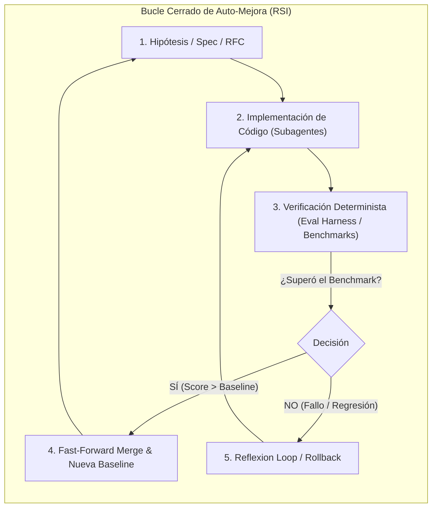

# 🧠 SOTA-001: Recursive Self-Improvement (RSI), Auto-Research y la Gobernanza en Bucles Cerrados de IA

- **Fecha:** 28 de Mayo de 2026 (Actualizado Septiembre 2026)
- **Categoría:** Estado del Arte / Arquitectura de Sistemas Compuestos / Auto-Mejora Recursiva
- **Fuentes Principales:**
  - *TechCrunch:* *"RSI is the new AGI — and it's just as hard to pin down"* (Russell Brandom, Mayo 2026) [^1]
  - *Andrej Karpathy:* Proyecto *Auto-Research* & Swarm Pre-training en Anthropic [^2]
  - *METR (Model Evaluation and Threat Research):* *"Six Milestones for AI Automation"* (Ajeya Cotra) [^3]
  - *Anthropic Research:* Internal Report on Claude Code & Mythos L4 Evaluation [^4]
  - *Georgetown CSET:* *"When AI Builds AI"* (Helen Toner et al.) [^5]
  - *Disarray AI:* *"When an MLE Agent Beats Humans: The Meat-and-Potatoes Engineering of AI"* (Doris Xin) [^6]

---

## 1. Contexto y Definición: ¿Qué es RSI y por qué reemplaza la narrativa de AGI?

El término **AGI (*Artificial General Intelligence*)** ha demostrado ser ambiguo y difícil de medir operativamente. En la frontera de investigación (Anthropic, OpenAI, DeepMind, Sakana AI, Adaption), el foco ha migrado hacia **RSI (*Recursive Self-Improvement* o Auto-Mejora Recursiva)**:

> **Definición Formal de RSI:**  
> La capacidad de un sistema de IA para gestionar el ciclo completo de **ideación, implementación, verificación y despliegue de mejoras sobre sí mismo o sobre bases de código complejas en un bucle cerrado sin intervención humana**.

---

## 2. Los 3 Hitos de Automatización de METR (Ajeya Cotra)

El reporte de METR (*Model Evaluation and Threat Research*) define tres estadios de transición en la ingeniería autónoma:

1. **Hito 1: *Adequacy* (Suficiencia):**  
   El sistema de IA puede ejecutar flujos completos de desarrollo e investigación de forma autónoma sin humanos en el bucle, aunque el resultado sea más lento o menos óptimo que el de un equipo senior.
2. **Hito 2: *Parity* (Paridad):**  
   Un sistema agéntico autónomo en bucle cerrado alcanza la misma calidad, consistencia y rendimiento que un equipo humano de ingeniería.
3. **Hito 3: *Supremacy* (Supremacía):**  
   El sistema agéntico en bucle cerrado supera holgadamente a los equipos híbridos (humano + IA), acelerando exponencialmente la velocidad de desarrollo.

---

## 3. Hallazgos Críticos: Las Debilidades del LLM y la "Degeneración Recursiva"

El reporte interno de Anthropic sobre el modelo **Mythos** y **Claude Code** destaca un contraste fundamental:
- **Éxito:** Cerca del 100% del código de *Claude Code* fue programado por la propia herramienta (dogfooding agéntico).
- **El Gran Cuello de Botella:** Al evaluar a los agentes contra el estándar de un ingeniero L4 (programador autónomo sin supervisión), los modelos fallan consistentemente en:
  1. *Verificación Determinista:* El LLM no puede "autojuzgarse" con precisión cognitiva; tiende a alucinar que su propio código funciona.
  2. *Seguimiento de Invariantes Complejos:* En tareas ambiguas de larga duración, olvida reglas de arquitectura (*Lost-in-the-Middle*).
  3. *Aislamiento y Colisiones:* Múltiples agentes sobre el mismo directorio colapsan por condiciones de carrera y bloqueos de archivos.

> ⚠️ **El Riesgo del "Model Drift / Autoregressive Collapse":**  
> Si un agente intenta auto-mejorar código basándose únicamente en su propio criterio conversacional, los errores se acumulan recursivamente hasta corromper el sistema.

---

## 4. La Tesis de Doris Xin (Disarray): "Meat-and-Potatoes Engineering"

Doris Xin demostró que un agente puede ganar 28 medallas de Kaggle frente a humanos no por "magia cognitiva", sino mediante **ingeniería rigurosa de arneses de evaluación**:
> *"Esto no es un esfuerzo puramente creativo; es ingeniería pragmática de infraestructura y confiabilidad."*

Esto confirma la premisa central del marco **AI-SDLC**: **La inteligencia del LLM es estocástica; la gobernanza del sistema debe ser determinista.**

---

## 5. Mapeo Directo con el Framework `ai-sdlc-framework`

Este análisis valida que la arquitectura que hemos construido en este repositorio implementa exactamente el sustrato necesario para hacer viable el RSI sin riesgo de degeneración:

| Desafío Identificado en la Literatura RSI | Solución Implementada en `ai-sdlc-framework` | Mecanismo Físico |
| :--- | :--- | :--- |
| **Alucinación de auto-verificación** | **Riel Duro Determinista** | `evals/harness.mjs` + `node --test` (SWE-bench paradigm). El commit solo se autoriza si el exit code es `0`. |
| **Amnesia de contexto e invariantes** | **Arquitectura Spec-First & Task Sequence Lock** | `.agents/tasks/INDEX.md` + `docs/specs/` + `validate-task-ids.mjs`. |
| **Colisiones en concurrencia multi-agente** | **Aislamiento Físico por Git Worktrees** | `.worktrees/subagent-X` en ramas efímeras independientes (`feat/task-XXX`). |
| **Comandos descontrolados / destructivos** | **Servidores Stdio MCP (JSON-RPC 2.0)** | Herramientas tipadas desacopladas de la terminal `bash`. |
| **Caja negra y falta de auditoría** | **Telemetría y Mission Control SSE** | `.agents/telemetry/events.jsonl` + Dashboard en tiempo real (`http://localhost:3333`). |

---

## 6. Oportunidades de Evolución Futura para el Framework

1. **Bucle de Auto-Optimización de Rendimiento (`recursive-self-improvement`):**
   - Permitir que un agente tome un módulo existente (ej. `CatalogService`), profile la latencia y memoria, pruebe optimizaciones (como pipeline de Redis o índices SQL) en un Git Worktree aislado, y solo emita un PR si el benchmark demuestra una mejora medible $\ge 15\%$ sin romper ninguna aserción unitaria.
2. **Generación Automática de Mutaciones de Test (Chaos Engineering):**
   - Un subagente "red team" que genera tests de estrés y edge cases automáticamente para endurecer los servicios antes de pasar a producción.

---

## 📚 Referencias & Enlaces

- [^1] **Brandom, R. (2026).** *RSI is the new AGI — and it's just as hard to pin down.* TechCrunch. [Enlace](https://techcrunch.com/2026/05/28/rsi-is-the-new-agi-and-its-just-as-hard-to-pin-down/).
- [^2] **Karpathy, A. (2026).** *Auto-Research: Autonomous Agent Swarms for Model Iteration.* [GitHub Repository](https://github.com/karpathy/autoresearch).
- [^3] **Cotra, A. (2026).** *Six Milestones for AI Automation.* Model Evaluation and Threat Research (METR) / Planned Obsolescence.
- [^4] **Anthropic Research (2026).** *Mythos Preview & L4 Autonomous Capability Assessment Report.*
- [^5] **Toner, H., et al. (2025/2026).** *When AI Builds AI: Governance and Trajectories of Recursive Systems.* Center for Security and Emerging Technology (CSET), Georgetown University.
- [^6] **Xin, D. (2026).** *When an MLE Agent Beats Humans: What Does That Actually Mean?* Disarray AI Research.
